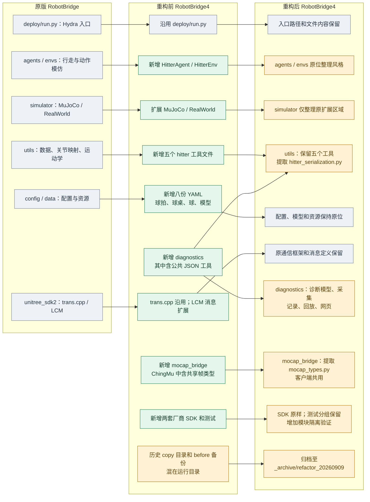
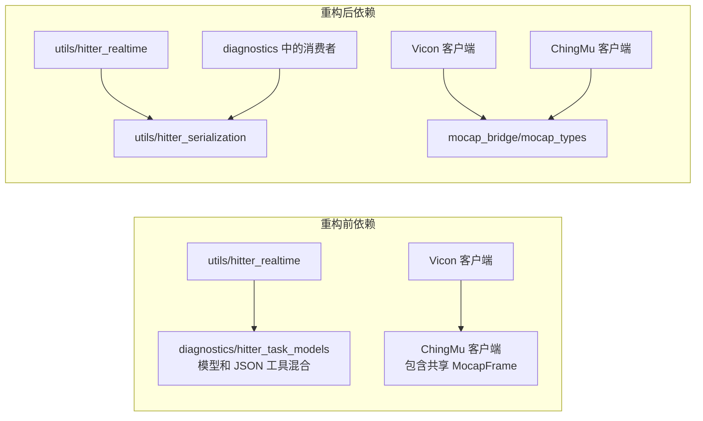

# RobotBridge4 重构后项目结构对比

2026-09-09。按 YHL 确认的方案 B 完成增量整理。本文比较的是原版项目、重构前磁盘状态、重构后可写副本；原始两个项目没有被修改。

| 版本 | 目录 |
| --- | --- |
| 原版 RobotBridge | `/home/yhl/Desktop/BAAI-Humanoid/RobotBridge` |
| 重构前 RobotBridge4 | `/home/yhl/Desktop/BOB/Hitter/RobotBridge4` |
| 重构后 RobotBridge4 | `/home/yhl/Desktop/RobotBridge4_refactor` |

## 1. 三个版本的结构

图中蓝灰色表示沿用原框架，绿色表示 HITTER 已有新增模块，黄色表示本次提取或归档。节点文字使用“新增”“提取”等普通文本，避免 Mermaid 把行首加号识别为 Markdown 列表。



原版与重构前的目录比较为：1,313 个相同文件、11 个修改文件、245 个新增文件，另有 37 个文件仅存在于原版。这是当前两个磁盘目录的对比，并不等同于 RobotBridge4 的 Git HEAD 差异。此次没有恢复那 37 个原版独有文件。

## 2. 本次真正改变的模块归属

| 原位置 | 新位置 | 变化原因 |
| --- | --- | --- |
| `deploy/diagnostics/hitter_task_models.py` 内的 `JsonScalar`、`JsonValue`、`freeze_json_value()`、`to_builtin_json()` | `deploy/utils/hitter_serialization.py` | 运行核心与诊断共用的 JSON 工具归入原有 utils，解除运行核心对诊断模型的依赖 |
| `deploy/mocap_bridge/chingmu_sdk_client.py` 内的 `MocapFrame` | `deploy/mocap_bridge/mocap_types.py` | 共享帧结构独立于厂商客户端，Vicon 和 ChingMu 直接引用同一个类型 |
| `deploy/mocap_bridge (copy)/`，共 13 个文件 | `_archive/refactor_20260909/deploy/mocap_bridge (copy)/` | 未发现活动代码引用，整体保留为历史副本；其中自己的历史标定也随副本保留 |
| 7 个第一方 `.before-*` 源码/配置备份 | `_archive/refactor_20260909/` 下的原相对路径 | 备份与活动模块分开，文件内容逐字节保留 |

原定义所在的三个文件继续存在并保留其自身职责；本次是定义迁移，并没有搬走整个诊断模型文件或整个 ChingMu 客户端。所有活动调用方使用新路径，没有添加旧路径转发文件或兼容别名。



Vicon 桥接入口仍复用已有桥接与标定逻辑；本次解除的是 Vicon 客户端为使用帧数据类型而加载 ChingMu 客户端的依赖，并未重写整个动捕桥。

## 3. 保留的原框架与 HITTER 扩展

```text
RobotBridge4_refactor/
├── deploy/
│   ├── run.py                              原入口，内容不变
│   ├── agents/
│   │   ├── 原版 agent 文件                 内容不变
│   │   └── hitter_agent.py                 HITTER 策略推理与运行循环
│   ├── envs/
│   │   ├── 原版 env 文件                   原样保留重构前状态
│   │   └── hitter.py                       HITTER 生命周期与 104 维观测
│   ├── simulator/
│   │   ├── base_sim.py                     内容不变
│   │   ├── mujoco.py                       原结构，整理扩展代码风格
│   │   └── real_world.py                   原结构，整理扩展代码风格
│   ├── utils/
│   │   ├── 原版工具                        内容不变
│   │   ├── hitter_planner.py               球状态估计与击球规划
│   │   ├── hitter_realtime.py              实时快照、工作线程、生命周期
│   │   ├── hitter_runtime_factory.py       配置解析与运行对象构造
│   │   ├── hitter_runtime_types.py         共享运行类型
│   │   ├── hitter_task_observation.py      击球任务观测
│   │   └── hitter_serialization.py         本次提取的共享 JSON 工具
│   ├── mocap_bridge/
│   │   ├── mocap_types.py                  本次提取的共享帧类型
│   │   ├── chingmu_sdk_client.py           ChingMu SDK 接入
│   │   ├── vicon_sdk_client.py             Vicon 流读取
│   │   ├── chingmu_table_lcm_bridge.py      标定、跟踪与发布
│   │   ├── vicon_table_lcm_bridge.py        Vicon Python 桥接入口
│   │   ├── vicon_table_lcm_bridge.cpp       Vicon C++ 桥接实现
│   │   ├── 其他探测、流读取和启动脚本      原位整理
│   │   ├── calibrations/                   可读标定原位保留
│   │   └── tests/                          动捕、坐标、协议测试
│   ├── diagnostics/                        保留为独立诊断模块
│   │   ├── hitter_task_models.py           诊断 schema 与数据模型
│   │   ├── hitter_task_attempts.py          尝试记录与统计
│   │   ├── hitter_task_events.py            事件流
│   │   ├── hitter_task_pipeline.py          影子任务流水线
│   │   ├── hitter_task_monitor.py           监控入口
│   │   ├── hitter_task_recording.py         会话记录
│   │   ├── hitter_task_replay.py            离线回放
│   │   ├── hitter_task_web.py               HTTP/SSE 服务
│   │   └── static/hitter_task_monitor.html  监控页面
│   ├── tests/                              规划、运行、诊断测试
│   ├── config/                             原配置分组与八份 HITTER YAML
│   └── data/                               原资源布局，模型/球拍/球桌/球
├── unitree_sdk2/                            原通信层及既有扩展消息
├── chingmu_sdk/                             第三方 SDK，内容不变
├── vicon_datastream_sdk/                    第三方 SDK，内容不变
├── docs/refactor_20260909/                   本次报告和逐文件审计
└── _archive/refactor_20260909/               20 个历史副本文件
```

普通 `MosaicEnv` 已有的 800/770 维差异没有在本次顺手修复。原有 `run.py`、`trans.cpp`、配置值、模型参数、关节顺序、LCM 协议、线程同步与击球状态机保持重构前行为。

## 4. 风格整理的覆盖范围

| 范围 | 审阅数 | 实际修改数 | 验证 |
| --- | ---: | ---: | --- |
| 原版不存在的活动 Python 文件 | 60 | 54 | Python 3.10 语法、AST 等价 |
| 原版不存在的活动 C++ 文件 | 6 | 6 | token 等价，全部编译，协议/跟踪测试 |
| 原版不存在的 Shell / HTML | 5 | 0 | 已有布局合适，逐字节保留；Shell 逐个检查语法 |
| 原有模拟器文件的扩展区域 | 2 | 2 | 63 个原版未变代码块保留；AST 等价 |
| 与原版相同的全部文件 | 1,313 | 0 | SHA256 核对 |

风格阶段共修改 **62 个程序文件**，没有对原有文件整体套用格式化器。随后结构阶段修改 **13 个已有 Python 文件的导入/定义归属**，新增 **2 个共享模块和 2 个测试文件（4 项测试）**；这两阶段的文件范围存在重叠，不能相加当作不同文件总数。审计脚本 `docs/refactor_20260909/style_check.py` 用于重现风格阶段证据，不属于部署运行模块。

## 5. 验证结果

| 检查 | 结果 |
| --- | --- |
| 纯风格阶段完整测试 | 与重构前每一项结果一致 |
| 最终完整 Python 测试 | 680 passed、110 个已有失败、2 skipped；另有 254 个通过的子测试 |
| 与基线比较 | 新增失败 0、缺失测试 0；新增 4 项测试全部通过 |
| C++ | 六个第一方文件编译通过，两个离线协议/跟踪测试通过，14 项跨语言测试通过 |
| 配置 / 模型 / XML | 两类 Hydra 配置展开、目标类导入、104→29 ONNX 推理和 MuJoCo 资源检查通过 |
| 启动器离线预检 | 当前 20260822 标定 SHA256 和 planner 参数通过核对 |
| 设备验证 | 未连接机器人或动捕设备，未执行真机闭环或在线发布 |

旧失败主要是测试夹具与现有 schema/接口不一致，保留在本次边界之外。最终通过数增加还包含构建二进制后恢复的两项既有 fixture 检查，并不表示本次修复了规划或生命周期逻辑。完整结果及统计口径见 [验证说明](verification_report.md)。

## 6. 副本与清单

副本保存了 1,557 个可读项目文件。12 个其他标定文件因读取权限未能复制，原文件仍在原目录；当前启动器使用的两份 20260822 标定已完整复制且预检通过。缓存、构建、recordings、outputs 等未作为源码复制，精确排除路径见 [原始快照](source_snapshot.json)。

- [原版与重构前目录分类](baseline_comparison.json)：所有原有、新增、修改、原版独有路径。
- [风格逐文件审计](style_audit.json)：格式整理与保留决定、AST/token 哈希、原代码块保护。
- [结构迁移报告](structure_report.md)：新模块、调用方、等价性和测试。
- [20 个归档文件映射](archive_manifest.json)：旧路径、新路径和原字节 SHA256。
- [最终逐文件变更 JSON](change_manifest.json) / [CSV](change_manifest.csv)：保留、修改、提取新增与归档条目。
- [整体审查](final_review.md) / [交付说明](handoff.md)：审查结论、补丁与范围。
- [最终完整性核对](final_audit.json)：原项目、原版和副本保留条件的检查结果。

原始两个项目保持不变；这些图描述的最终结果位于 `RobotBridge4_refactor`。如需向原目录应用，可使用另外提供的变更补丁；需要原目录写权限，且应先核对原目录仍与本次快照一致。补丁不会包含本地 Git 元数据和临时构建产物。
