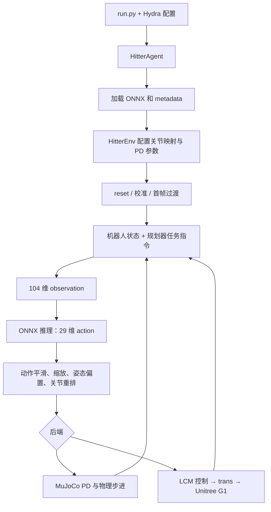
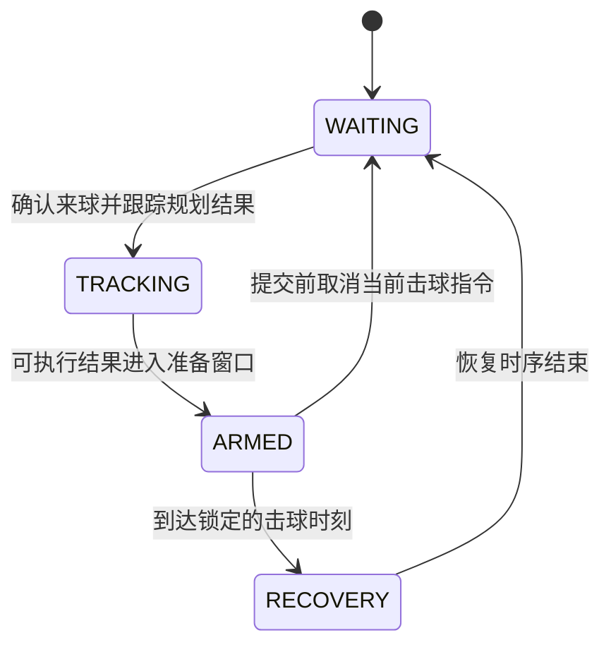

# RobotBridge4

> 2026-09-19 资料整理：本文已从 Desktop 根目录移入资料目录，相关链接已更新。[资料总索引](../README.md)。历史核验日期与结论保留。

> 重构交付索引（2026-09-09）：本文保留对原始目录的说明。已完成的可写副本见 [RobotBridge4_refactor README](../../RobotBridge4_refactor/README.md)，三方结构与本次变化见 [重构后项目结构对比](RobotBridge4_重构后项目结构对比.md)。

基于 MOSAIC 与 RobotBridge 的 Unitree G1 乒乓球部署系统。

RobotBridge4 将球轨迹预测、击球规划和学习式全身控制连接起来：根据来球状态计算机器人站位、球拍目标位置、速度与击球时刻，再通过 HITTER ONNX 策略控制 G1 的 29 个关节。支持 MuJoCo 仿真和通过 Unitree SDK2 接入真机。

MOSAIC-main 负责训练和导出策略，RobotBridge4 负责加载、规划与执行。本文按照原版 RobotBridge README 的结构整理，描述当前 RobotBridge4 的 HITTER 主流程。

> 文档核对日期：2026-09-08。以下默认值来自本目录当前源码和配置，不表示已经在本机完成安装、仿真或真机验证。命令中的根目录使用 `/home/yhl/Desktop/BOB/Hitter/RobotBridge4`；在其他机器上运行时，应替换为实际项目路径。文内源码链接已按资料目录位置调整，仍指向原始 RobotBridge4。

## ✨ 功能

- **G1 全身击球控制**：固定右手球拍，支持正手和反手目标，输出 29 维关节动作。
- **基于模型的击球规划**：估计球速度，预测含重力、空气阻力和桌面反弹的轨迹，计算击球点、时间、球拍速度和站位。
- **实时击球状态机**：跟踪来球身份，管理等待、跟踪、准备击球和恢复阶段。
- **训练与部署接口对齐**：从 ONNX metadata 读取关节顺序、默认姿态、动作缩放和 PD 参数。
- **统一部署入口**：通过 Hydra 的 `sim=mujoco` / `sim=real_world` 选择后端。
- **动捕与机器人通信分离**：Vicon 提供球和骨盆位姿，Unitree SDK2 提供机器人状态和底层控制。
- **诊断与回放**：提供 v2 动捕消息监视、任务观测网页、录制和离线回放模块。

仓库还保留 locomotion、MOSAIC、GMT、Twist 等原版模块。HITTER 入口使用独立的 `HitterAgent` 和 `HitterEnv`，不会自动进入 locomotion/mimic 切换流程。

## 📦 安装与运行前提

### 1. Python 环境

已有部署记录使用名为 `rb` 的 Conda 环境。优先使用已经验证的部署环境：

```bash
conda activate rb
cd /home/yhl/Desktop/BOB/Hitter/RobotBridge4
```

Python 依赖见 [requirements.txt](../../RobotBridge4/requirements.txt)，包括 NumPy、SciPy、MuJoCo、Hydra、ONNX Runtime、LCM、PyTorch 等。该文件没有锁定版本，不能据此恢复历史环境的精确依赖组合。原版 README 中的 Python 3.8 安装示例也不是本 HITTER 分支的已验证环境规格。

新建环境时，在选定的 Python 环境中安装：

```bash
python -m pip install -r requirements.txt
```

此命令可能安装或调整 PyTorch 等依赖；训练环境和部署环境的依赖组合应分别管理。真机后端也使用 MuJoCo 模型进行运动学计算，因此仍需要 MuJoCo 和机器人 XML 资产。

### 2. 真机 C++ 依赖与构建

需要支持 C++17 的编译器、CMake、LCM 的头文件与链接库、`pkg-config`，以及项目中的 Unitree SDK2 和 Vicon DataStream SDK。

构建机器人通信层：

```bash
cd /home/yhl/Desktop/BOB/Hitter/RobotBridge4
cmake -S unitree_sdk2 -B unitree_sdk2/.build-robotbridge4-v2
cmake --build unitree_sdk2/.build-robotbridge4-v2 --target trans -j
```

目标产物是 `unitree_sdk2/.build-robotbridge4-v2/bin/trans`，对应 [trans.cpp](../../RobotBridge4/unitree_sdk2/trans.cpp)。

构建 Vicon v2 桥接程序：

```bash
bash deploy/mocap_bridge/build_v2_mocap.sh
```

该脚本使用项目内的 x86_64 SDK 库，产物包括 `deploy/mocap_bridge/.build-v2/vicon_table_lcm_bridge_v2` 和两个 C++ 检查程序。SDK 文件路径和系统 LCM 链接库必须实际存在。

## 🚀 快速开始

### 1. MuJoCo 中运行 HITTER

```bash
conda activate rb
cd /home/yhl/Desktop/BOB/Hitter/RobotBridge4/deploy

python run.py --config-name=hitter sim=mujoco device=cpu
```

入口配置是 [config/hitter.yaml](../../RobotBridge4/deploy/config/hitter.yaml)。不指定 `--config-name=hitter` 时，`run.py` 默认加载的是 `mosaic`。

当前 HITTER 默认配置：

| 项目 | 值 |
| --- | --- |
| 机器人 | `g1_hitter_racket`，29 自由度 |
| 模型 | `./data/model/hitter/hitter_model20500_20260818_104.onnx` |
| 资产 | `./data/assets/g1/g1_29dof_hitter_racket_table_tennis.xml` |
| 后端 / 设备 | MuJoCo / CPU |
| 控制周期 | `0.005 × 4 = 0.02 s`，即 50 Hz |
| 窗口 / 实时节拍 | `viewer: True` / `real_time: True` |
| 发球时刻 | 仿真相对时间 `[0.0, 20.0] s` |

MuJoCo 直接提供球位置和速度，规划器据此生成击球指令。第二次发球恢复第一次保存的球初始状态。当前代码只接受 `[0.0, 20.0]` 这一非空发球时间表，不能把它当作任意时间列表使用；两次发球完成后也不会自动无限发球。

这个入口不要求传入参考动作 `.npz`。参考动作主要在 MOSAIC 训练阶段使用，部署策略的任务指令来自规划器。

### 2. 替换 ONNX 模型

```bash
python run.py --config-name=hitter sim=mujoco device=cpu \
  mimic.policy.checkpoint=/absolute/path/to/hitter_policy.onnx
```

模型必须符合本文后面的 104 维观测、29 维动作及 metadata 约定。训练 checkpoint `.pt` 不能直接替代 HITTER ONNX：虽然 `BaseAgent` 保留 TorchScript 加载分支，但 HITTER 的 metadata 配置和推理循环使用 ONNX 接口。

### 3. 真机部署：三个终端

真机链路包括 Vicon bridge、Unitree transition layer 和 Python policy layer。启动策略前应先确认动捕与机器人状态通信可用，并按照现场既有低层控制流程操作机器人。

#### 启动前：检查固定标定组合

```bash
cd /home/yhl/Desktop/BOB/Hitter/RobotBridge4
bash deploy/mocap_bridge/run_robotbridge4_vicon_real.sh --check-only
```

该检查不连接 Vicon、不发布消息，但要求桥接可执行文件存在。通过时输出 `Calibration preflight: PASS`。

当前启动脚本锁定：

- `vicon_table_frame_20260822_validated.json`
- `vicon_g1_pelvis_orientation_20260822_validated.json`

启动器检查两份文件的 SHA256，并核对球桌尺寸、中心、LCM 通道及骨盆 subject 与 `config/mimic/hitter.yaml` 一致。

检查 Vicon 实时连接时可使用：

```bash
bash deploy/mocap_bridge/run_robotbridge4_vicon_real.sh --check-live
```

这会连接 Vicon 运行 3 秒，使用 `--no-publish`，不发布 LCM 消息。

#### 终端 1：Vicon bridge

```bash
cd /home/yhl/Desktop/BOB/Hitter/RobotBridge4
bash deploy/mocap_bridge/run_robotbridge4_vicon_real.sh
```

当前脚本使用 Vicon 地址 `192.168.10.1:801`、tracker `G1Pelvis`、输出骨盆名称 `G2Pelvis`、通道 `vicon_state_data_v2`，帧率参数为 300 Hz。它将标定后的数据发布到 `udpm://239.255.76.67:7667?ttl=255`。这些是启动脚本中的现场参数，不是自动探测结果。

#### 终端 2：机器人通信层

以下 `enx9c69d30201e2` 是已有部署文档中的网卡示例，运行前替换为实际连接机器人网络的接口名。

```bash
cd /home/yhl/Desktop/BOB/Hitter/RobotBridge4
LD_LIBRARY_PATH="$PWD/unitree_sdk2/thirdparty/lib/x86_64:${LD_LIBRARY_PATH:-}" \
  ./unitree_sdk2/.build-robotbridge4-v2/bin/trans enx9c69d30201e2
```

根据终端提示按 Enter 建立通信。

#### 终端 3：HITTER policy

```bash
conda activate rb
cd /home/yhl/Desktop/BOB/Hitter/RobotBridge4/deploy
LOGURU_LEVEL=INFO PYTHONUNBUFFERED=1 \
  python -u run.py --config-name=hitter sim=real_world device=cpu
```

`RealWorld.calibrate()` 中，第一次按下并释放 R2 后机器人向默认姿态过渡；再次按下并释放 R2，在有效骨盆状态满足启动条件后进入策略流程。随后 HITTER 默认用 5 秒插值过渡到第一次策略输出的关节目标，再开始新的击球会话。

运行中 R2 会触发返回校准流程。通信层中 `L2+B` 进入阻尼模式，`L2+Y` 恢复策略模式；阻尼模式与 Python 侧的等待/恢复状态不是同一个状态机。

> [原专用部署说明](../../RobotBridge4/deploy/mocap_bridge/ROBOTBRIDGE4_REAL_DEPLOYMENT.md)仍写 20260818 标定。当前执行依据是 [run_robotbridge4_vicon_real.sh](../../RobotBridge4/deploy/mocap_bridge/run_robotbridge4_vicon_real.sh)及其校验通过的组合。不要混用不同日期的标定文件和旧通道命令。

## 📚 配置指南

### 配置组织

```yaml
# deploy/config/hitter.yaml 的 defaults
defaults:
  - robot: g1_hitter_racket
  - obs: hitter
  - sim: mujoco
  - env: hitter
  - agent: hitter
  - mimic: hitter
  - _self_

device: cpu
```

| 配置文件 | 职责 |
| --- | --- |
| [hitter.yaml](../../RobotBridge4/deploy/config/hitter.yaml) | 组合入口，并启用 MuJoCo table-tennis 配置 |
| [robot/g1_hitter_racket.yaml](../../RobotBridge4/deploy/config/robot/g1_hitter_racket.yaml) | 组合机器人资产和控制配置 |
| [asset/g1_hitter_racket.yaml](../../RobotBridge4/deploy/config/asset/g1_hitter_racket.yaml) | XML、关节顺序、初始位置与默认控制参数 |
| [control/g1_hitter_racket.yaml](../../RobotBridge4/deploy/config/control/g1_hitter_racket.yaml) | 控制周期、裁剪、实时运行和窗口开关 |
| [mimic/hitter.yaml](../../RobotBridge4/deploy/config/mimic/hitter.yaml) | 模型路径、首帧过渡、动捕消费者、规划器和状态机参数 |
| [env/hitter.yaml](../../RobotBridge4/deploy/config/env/hitter.yaml) | 构造 `envs.hitter.HitterEnv` |
| [agent/hitter.yaml](../../RobotBridge4/deploy/config/agent/hitter.yaml) | 构造 `agents.hitter_agent.HitterAgent` |
| [obs/hitter.yaml](../../RobotBridge4/deploy/config/obs/hitter.yaml) | 保留通用配置接口；具体 HITTER 观测由 Python 显式组装 |
| [sim/mujoco.yaml](../../RobotBridge4/deploy/config/sim/mujoco.yaml) / [sim/real_world.yaml](../../RobotBridge4/deploy/config/sim/real_world.yaml) | 后端类和资产、控制配置注入 |

### 命令行覆盖

从 `deploy/` 执行；配置中的模型和资产相对路径按此工作目录使用。

```bash
# 仅展开并解析配置，不构造 agent 或连接机器人
python run.py --config-name=hitter --cfg job --resolve

# 关闭仿真窗口
python run.py --config-name=hitter sim=mujoco robot.control.viewer=false

# 在仿真中固定正手，便于单独检查该分支
python run.py --config-name=hitter sim=mujoco \
  mimic.motion.ball_planner.force_strike_type=forehand
```

切换后端使用 `sim=real_world`，模型路径使用 `mimic.policy.checkpoint=...`。HITTER 真机代码拒绝强制正手/反手配置，正常运行根据击球点在球桌坐标中的 Y 位置选择类型。

### 当前关键参数

下表来自 `config/mimic/hitter.yaml`，只说明当前部署值；训练分布应从对应模型的原始训练配置核对。

| 参数 | 默认值 | 含义 |
| --- | --- | --- |
| `ball_planner.planner_update_rate_hz` | 100 | 实时规划提交频率设置 |
| `ball_planner.state_estimator_window_size` | 31 | 球状态拟合窗口 |
| `ball_planner.minimum_stable_incoming_speed_x_mps` | 0.20 | 沿世界系 −X 来球的速度阈值 |
| `ball_planner.stable_incoming_confirmation_snapshots` | 3 | 稳定来球确认所需快照数 |
| `ball_planner.virtual_hit_plane_x` | 0.0 m | 世界系虚拟击球平面 |
| `ball_planner.arm_time_to_strike_s` | 0.92 s | 进入准备击球窗口的上界 |
| `ball_planner.minimum_arm_time_to_strike_s` | 0.30 s | 新指令进入准备窗口的下界 |
| `ball_planner.commit_time_to_strike_s` | 0.30 s | 状态机进入提交阶段的时间阈值 |
| `ball_planner.swing_duration_range` | 1.75–1.95 s | 挥拍与恢复时序采样范围 |
| `ball_planner.racket_x_offset_b` | 0.40 m | 站位规划使用的球拍相对身体前向偏移 |
| `vicon_consumer.stream_timeout_s` / `ball_timeout_s` | 0.40 / 0.40 s | 消息新鲜度限制 |
| `policy.real_world_first_frame_transition_s` | 5.0 s | 真机策略首帧目标过渡时间 |

表中 `ball_planner`、`vicon_consumer` 属于 `mimic.motion`，`policy` 属于 `mimic.policy`。配置同时保留估计器采样率 360 Hz 和桥接帧率参数 300 Hz，两者是不同层的设置，不能将任一配置值当作实际测得的消息频率。

当前球桌中心为 `[1.365369, 0.0] m`，长、宽、高分别为 `2.730738、1.512451、0.760000 m`。部署时以启动器与标定文件的一致性检查为准。

## 🏗️ 系统架构与执行逻辑

### 目录结构

```text
RobotBridge4/
├── README.md
├── requirements.txt
├── deploy/                         # Python 部署层
│   ├── run.py                      # Hydra 入口，构造 agent 并运行
│   ├── agents/
│   │   ├── base_agent.py            # 模型加载基础类
│   │   └── hitter_agent.py          # ONNX metadata 接入及推理循环
│   ├── envs/
│   │   ├── base_env.py              # reset / step 通用流程
│   │   └── hitter.py                # HITTER 指令、观测、动作与复位
│   ├── simulator/
│   │   ├── base_sim.py              # 后端公共状态接口
│   │   ├── mujoco.py                # MuJoCo 球状态、机器人与 PD 执行
│   │   └── real_world.py            # 真机状态、动捕消费与 LCM 控制
│   ├── utils/
│   │   ├── hitter_planner.py        # 状态估计、球轨迹、击球与站位规划
│   │   ├── hitter_realtime.py       # 异步 worker、快照与击球状态机
│   │   ├── hitter_runtime_types.py  # 轨迹身份和规划失败类型
│   │   ├── hitter_runtime_factory.py # 从配置构造各运行模块
│   │   ├── hitter_task_observation.py # 11 维任务观测组装
│   │   ├── dataset.py              # ONNX metadata 解析
│   │   ├── dof.py                  # 关节顺序转换
│   │   └── kinematics.py           # 基于 MuJoCo 的正运动学
│   ├── config/                     # Hydra 配置组
│   ├── data/
│   │   ├── assets/                 # G1、球拍、球桌和球的资产
│   │   └── model/hitter/            # ONNX 及模型 provenance 记录
│   ├── mocap_bridge/
│   │   ├── run_robotbridge4_vicon_real.sh # 固定标定的真机动捕入口
│   │   ├── build_v2_mocap.sh        # C++ v2 bridge 构建
│   │   ├── vicon_table_lcm_bridge.cpp # 当前启动器执行程序的源码
│   │   ├── monitor_vicon_lcm.py     # v2 消息监视与 CSV 记录
│   │   ├── calibrations/           # 球桌、骨盆标定文件
│   │   └── tests/                  # 动捕及消息协议检查
│   ├── diagnostics/                # 只读网页、任务诊断、录制和回放
│   └── tests/                      # 规划、状态机、观测和部署逻辑测试
├── unitree_sdk2/
│   ├── trans.cpp                   # LCM ↔ Unitree DDS 通信层
│   └── lcm_types/                  # Python / C++ 消息定义
├── vicon_datastream_sdk/            # Vicon SDK
├── chingmu_sdk/                     # 保留的 ChingMu SDK
├── docs/                           # 诊断手册及历史设计、实施记录
└── recordings/                     # 运行录制数据
```

该目录树突出 HITTER 主链路，没有展开原版 locomotion/mimic 模块、历史副本、构建产物和全部 SDK 文件。

### 1. 从入口到动作执行



真机中，`HitterAgent` 在每次推理前刷新状态和任务观测，并按 50 Hz 进行策略循环。球规划通过独立 worker 执行；MuJoCo 分支从仿真状态同步生成规划结果，运行节拍由仿真后端控制。

### 2. 球状态如何变成击球任务

[hitter_planner.py](../../RobotBridge4/deploy/utils/hitter_planner.py)将任务拆为五部分：

| 类 | 输入与输出 |
| --- | --- |
| `BallStateEstimator` | 对球位置序列做二次最小二乘拟合，估计当前位置和速度，并处理反弹附近的估计窗口 |
| `BallTrajectoryPredictor` | 根据位置、速度和物理参数预测球轨迹及桌面反弹 |
| `StrikePlanner` | 找到未来击球平面交点，根据期望落点计算出球速度及目标球拍速度 |
| `BaseTargetPlanner` | 根据击球点和正反手相对身体偏移，计算机器人站位 |
| `HitterSystemPlanner` | 组合上述结果，输出 `HitterWbcCommand` |

指令包含正/反手类型、世界系站位、球拍位置和速度、距离击球的时间。无强制类型时，击球点世界系 Y 小于 0 选择正手，否则选择反手。

MuJoCo 直接读取仿真球速度；真机需要先通过动捕位置序列估计速度。两种运行方式不能视为相同的感知输入条件。

### 3. 一颗球的生命周期



图示为常规流程；代码还处理恢复期间缓存下一颗球、直接进入准备窗口、连续失败及输入故障等分支。

- `track_id` 标识一条球轨迹，`generation` 标识该轨迹的快照版本。
- `LatestOnlyPlannerWorker` 最多保留一个待处理快照；完成结果另有有界队列，不能将其理解为只保存最后一个完成结果。
- `ARMED` 阶段会约束后续规划结果对位置、速度和击球截止时间的改动。
- 进入提交阶段后，部分取消事件会保留已提交指令；取消、阻尼和程序退出不能混为一谈，具体处理取决于状态及失败原因。
- 到达截止时间后，轨迹被标记为已消费，防止同一 `track_id` 重复触发击球。
- `struck` 是“计划击球时刻已到”的状态机事件，不能据此计算实际触球率或回球成功率。

### 4. 104 维观测与 29 维动作

[HitterEnv._compute_hitter_observation()](../../RobotBridge4/deploy/envs/hitter.py)按下表顺序显式拼接输入，当前代码要求总维度恰好为 104。

| 字段 | 维度 | 语义 |
| --- | --- | --- |
| `base_ang_vel` | 3 | 机器人本体角速度 |
| `projected_gravity` | 3 | 本体坐标中的重力投影 |
| `base_forward_xy` | 2 | 骨盆前向轴在世界系 XY 平面的分量 |
| `base_target_xy` | 2 | 站位目标相对骨盆的位置，转换到仅含 yaw 的局部坐标 |
| `racket_target_pos` | 3 | 球拍目标相对骨盆的位置，转换到仅含 yaw 的局部坐标 |
| `racket_target_vel` | 3 | 世界坐标系中的球拍目标速度 |
| `time_to_strike` | 1 | 距离锁定击球时刻的剩余时间 |
| `joint_pos` | 29 | 策略关节顺序下，相对模型默认姿态的关节位置 |
| `joint_vel` | 29 | 策略关节顺序下的关节速度 |
| `actions` | 29 | 上一时刻经过平滑的策略动作 |

其中索引 `6:17` 是 11 维任务观测，由 [hitter_task_observation.py](../../RobotBridge4/deploy/utils/hitter_task_observation.py)组装。当前输入是单帧 104 维，不使用普通 MOSAIC 的 800 维历史观测。

等待阶段，真机使用捕获的等待站位 anchor，MuJoCo 使用配置的等待目标。球拍等待目标由当前机器人正运动学计算，目标速度为零，默认剩余击球时间为 0.92 秒。

ONNX 输出经如下变换成为关节位置目标：

```text
smoothed_action = (1 - beta) × previous_action + beta × action
q_target_policy = default_joint_pos + action_scale × smoothed_action
q_target_sim    = 将 q_target_policy 重排到后端关节顺序
```

`beta` 当前为 1.0。MuJoCo 用该位置目标及 PD 参数计算力矩；真机通过 `pd_plustau_targets` 发送位置、速度、增益和前馈力矩字段，由 `trans` 写入 Unitree 低层命令。

### 5. 模型 metadata 与 MOSAIC 衔接

训练入口在相邻的 `MOSAIC-main/scripts/rsl_rl/train.py`，正式任务为 `Hitter-Striking-PlannerDomain-Flat-G1-v0`。`play.py` 配合 exporter 生成 ONNX。

RobotBridge4 通过 [dataset.py](../../RobotBridge4/deploy/utils/dataset.py)中的 `MosaicModelMeta` 解析模型信息，再由 `HitterEnv.configure_from_modelmeta()` 应用到后端：

- `joint_names`：策略关节顺序。
- `default_joint_pos`、`action_scale`：动作到关节目标的映射。
- `joint_stiffness`、`joint_damping`：PD 参数。
- `anchor_body_name`、`body_names`：身体定义。
- `observation_names`、`observation_history_lengths`：导出时记录的观测描述。

观测顺序仍由 HITTER 代码显式实现，metadata 不会自动重新组织它。模型能加载、维度相符，并不能单独证明训练与部署的坐标、顺序和归一化语义完全一致。

当前默认模型的 [provenance](../../RobotBridge4/deploy/data/model/hitter/hitter_model20500_20260818_104.provenance.txt)记录：输入 `[1,104]`，输出 `[1,29]`，网络为 `104 → 512 → 256 → 128 → 29`。其导出复用了 model17500 快照的配置与 metadata；该记录包含历史数值一致性检查，但没有在准备该产物时完成 MuJoCo 行为或真机运动测试。重新导出时应核对对应快照，不能直接假定顶层最新训练配置就是此模型的训练配置。

### 6. 真机通信接口

| LCM 通道 | 方向 | 内容 |
| --- | --- | --- |
| `vicon_state_data_v2` | Vicon bridge → Python | 球、球桌、骨盆位姿，时间戳、轨迹身份及有效性 |
| `state_estimator_data` | `trans` → Python | 机器人基座/IMU 状态 |
| `body_control_data` | `trans` → Python | 关节状态 |
| `rc_command_data` | `trans` → Python | 遥控器状态 |
| `pd_plustau_targets` | Python → `trans` | 关节 PD 控制目标 |

消息类仍命名为 `transformation_t`，但当前定义含 `track_id`、源帧号、时间戳、`valid` 和 `occluded` 字段。不能根据类名判断它是旧协议；发送端和接收端必须使用一致的消息定义。

## 🤖 机器人与运行模式

| 模式 | 当前 HITTER 用途 |
| --- | --- |
| G1 + 固定右手球拍，MuJoCo | 使用球桌和球资产进行规划、策略和物理执行检查 |
| G1 + 固定右手球拍，真机 | Vicon v2 输入、机器人状态与 ONNX 联合控制 |
| 独立任务诊断 | 只读订阅，复现规划/任务观测，提供网页与录制 |

其他机器人配置、`loco_mimic` 等入口是保留的原版能力；其存在不表示当前 HITTER 模型支持其他自由度或平台。ChingMu ghost-ball 半实物模式位于相邻的独立项目 `RobotBridge2-chingmu-ghost-mujoco-20260731`，不属于本文的 RobotBridge4 默认后端。

## 🐛 常见问题

| 现象 | 先检查什么 |
| --- | --- |
| 启动了普通动作模仿而非击球 | 是否显式使用 `--config-name=hitter` |
| 模型/资产找不到 | 是否从 `deploy/` 启动；`mimic.policy.checkpoint` 和资产路径是否存在 |
| ONNX 输入维度错误 | 是否为 HITTER 104 维模型；不要使用普通 MOSAIC 800 维模型 |
| 关节目标或姿态异常 | 模型来源、关节顺序、默认姿态、action scale、PD 参数及坐标定义是否对应 |
| 有球数据但没有进入 `ARMED` | 骨盆是否有效、估计器是否就绪、来球方向与速度、未来击球平面交点、目标高度及准备时间窗口 |
| `VICON_SCHEMA_ERROR` / `TRACK_ID_CONFLICT` | bridge、Python 消息定义和轨迹 ID 是否一致 |
| `VICON_STREAM_STALE` / `BALL_MESSAGE_STALE` | 消息是否持续到达，网络、遮挡和时间戳是否正常 |
| 校准检查失败 | 桥接二进制、标定文件 SHA256 及 YAML 几何参数；不要绕过启动器校验 |
| R2 后没有进入策略 | 机器人状态通信、按键按下/释放事件和有效骨盆启动条件 |
| 仿真只发两次球 | 当前配置和实现就是 `[0.0,20.0]` 两次发球，不是无限发球器 |
| 日志出现 `struck` 但没有接到球 | 该事件只表示到达计划击球时间，需要独立检查真实接触与回球结果 |
| 网页没有数据 | 诊断入口默认仍是旧通道名；显式指定 `--channel vicon_state_data_v2` |

`run.py` 会把详细日志写入 Hydra 输出目录的 `eval.log`，实际路径在启动终端打印。需要更多终端日志时使用 `LOGURU_LEVEL=DEBUG`。

## 📌 诊断与评估

### 1. 只读监视 v2 动捕消息

在已有 Vicon bridge 发布数据时，从项目根目录执行：

```bash
conda activate rb
cd /home/yhl/Desktop/BOB/Hitter/RobotBridge4
python deploy/mocap_bridge/monitor_vicon_lcm.py \
  --channel vicon_state_data_v2 --duration 10
```

该程序检查消息约定，并可通过 `--csv /absolute/path/ball.csv` 保存球样本；它不启动机器人 policy。

### 2. 任务观测网页

```bash
cd /home/yhl/Desktop/BOB/Hitter/RobotBridge4/deploy
python -m diagnostics.hitter_task_monitor \
  --mimic-config config/mimic/hitter.yaml \
  --control-config config/control/g1_hitter_racket.yaml \
  --table-calib mocap_bridge/calibrations/vicon_table_frame_20260822_validated.json \
  --pelvis-calib mocap_bridge/calibrations/vicon_g1_pelvis_orientation_20260822_validated.json \
  --lcm-url 'udpm://239.255.76.67:7667?ttl=255' \
  --channel vicon_state_data_v2 \
  --base-name G2Pelvis --ball-name ball --port 8766
```

打开 `http://127.0.0.1:8766/`。诊断程序只读订阅数据，在独立进程中运行 estimator、planner、lifecycle 和 11 维任务观测组装，不加载 ONNX，也不发送机器人控制命令。其页面反映诊断进程的计算，不能直接证明生产策略实际收到相同观测。

球数据可以独立显示；完整任务链路仍需要有效骨盆位姿。估计器就绪、规划就绪、进入准备窗口和实际触球是不同阶段，应分别检查。

更多字段及录制说明见 [任务观测诊断文档](../../RobotBridge4/docs/hitter_task_observation_diagnostics.md)。该历史文档中的 RobotBridge2 路径、旧通道和 ChingMu 标定示例应与这里的 RobotBridge4 启动参数区分。

### 3. 分层检查

| 检查层 | 能说明什么 |
| --- | --- |
| 配置展开、文件和 metadata 检查 | 参数与结构是否齐全 |
| MuJoCo 执行 | 仿真中的规划、姿态、挥拍和物理响应 |
| v2 消息监视 | 动捕输入是否有效、新鲜、符合消息约定 |
| 独立任务诊断 | 该诊断链路的来球判断、规划和任务观测状态 |
| 现场触球与落点记录 | 真实接触、回球和目标落点效果 |

[deploy/tests](../../RobotBridge4/deploy/tests)和 [mocap_bridge/tests](../../RobotBridge4/deploy/mocap_bridge/tests)包含单球生命周期、完成结果队列、观测、规划速度、首帧过渡、v2 消费者、物理球与录制回放等检查。测试文件的存在不代表当前环境已运行并通过；本次文档整理没有执行这些测试或控制程序。

## 📄 许可与文档维护

许可信息见 [LICENSE](../../RobotBridge4/LICENSE)。项目沿用 MOSAIC、RobotBridge、Unitree SDK2、MuJoCo 和 Hydra 等组件。

维护 HITTER 文档时，应同时核对模型 provenance、`config/mimic/hitter.yaml`、`HitterEnv` 观测顺序和真机标定启动器。历史计划、测试报告及部署记录用于追溯，不应覆盖当前源码已经变化的参数。
