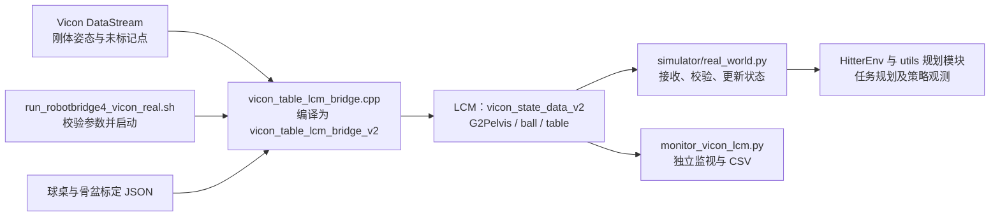

# RobotBridge4_refactor：Vicon 脚本结构与用途说明

> 2026-09-19 资料整理：本文已从 Desktop 根目录移入资料目录，相关链接已更新。[资料总索引](../README.md)。历史核验日期与结论保留。

梳理日期：2026-09-10。依据当前 `/home/yhl/Desktop/BOB/Hitter/RobotBridge4_refactor` 的源码与启动脚本。本次只新增说明文档，不修改程序，也不连接设备。

**当前真机使用“Shell 启动器 → C++ Vicon 桥 → LCM → RealWorld”的路线。项目还保留了一条 Python 桥路线，以及原始数据探测、消息监视、标定和测试工具。**

## 1. 文件结构

下面保留真实目录位置，只展示与 Vicon 有关的文件。`.cpp` 是源文件，`.build-v2/`、`bin/` 中是编译产物。

```text
RobotBridge4_refactor/
├── deploy/
│   ├── mocap_bridge/
│   │   ├── run_robotbridge4_vicon_real.sh    # 当前真机动捕启动入口
│   │   ├── vicon_table_lcm_bridge.cpp       # 当前 C++ 标定、跟踪、发布实现
│   │   ├── build_v2_mocap.sh               # 构建当前 v2 桥和两个 C++ 测试
│   │   ├── .build-v2/
│   │   │   ├── vicon_table_lcm_bridge_v2    # 当前启动器实际执行的程序
│   │   │   ├── test_transformation_t_v2
│   │   │   └── test_vicon_ball_track_v2
│   │   │
│   │   ├── vicon_table_lcm_bridge.py        # 另一条 Python 桥接路线
│   │   ├── vicon_sdk_client.py              # 管理取帧子进程，接收 JSON 帧
│   │   ├── mocap_types.py                   # Python 共用的 MocapFrame 类型
│   │   ├── vicon_frame_stream.cpp           # SDK 原始帧转 JSON
│   │   ├── build_vicon_frame_stream.sh      # 构建 Python 路线的取帧程序
│   │   ├── bin/vicon_frame_stream          # Python client 默认 helper
│   │   │
│   │   ├── nexus_probe_cpp.cpp             # 查询对象名称、读取指定对象、导出 CSV
│   │   ├── vicon_datastream_dump.cpp        # 打印一帧较完整的 SDK 数据
│   │   ├── monitor_vicon_lcm.py             # 订阅桥处理后的 LCM 数据
│   │   ├── build_cpp_probe.sh              # 旧的探测/桥接综合构建脚本
│   │   ├── ROBOTBRIDGE4_REAL_DEPLOYMENT.md  # 当前三终端部署说明
│   │   ├── calibrations/
│   │   │   ├── vicon_table_frame_20260822_validated.json
│   │   │   ├── vicon_g1_pelvis_orientation_20260822_validated.json
│   │   │   └── …                           # 其他日期的历史/候选标定
│   │   └── tests/
│   │       ├── test_vicon_sdk_client.py
│   │       ├── test_vicon_table_lcm_bridge.py
│   │       ├── test_vicon_ball_track_v2.cpp
│   │       ├── test_transformation_t_v2.cpp
│   │       ├── test_transformation_t_v2.py
│   │       └── test_mocap_v2_monitor.py
│   ├── simulator/real_world.py             # 部署侧接收并校验 Vicon 消息
│   └── config/mimic/hitter.yaml            # 通道、骨盆名称、球桌及任务参数
├── unitree_sdk2/lcm_types/
│   ├── transformation_t.lcm                # 动捕消息结构定义
│   ├── transformation_t.hpp                # C++ 编解码
│   └── transformation_t.py                 # Python 编解码
└── vicon_datastream_sdk/
    ├── setup_env.sh                        # 配置当前 Shell 的 SDK 库路径
    └── linux64/Linux64/                    # SDK 头文件和动态库
```

迁移核验还在 `.build-v2/` 中编译了 `nexus_probe_cpp`、`vicon_datastream_dump` 和 `vicon_frame_stream`。这些额外产物不属于 `build_v2_mocap.sh` 默认生成的三项。`bin/` 内另有历史桥接/测试产物；当前真机启动器使用上图标出的 `.build-v2/vicon_table_lcm_bridge_v2`。

## 2. 当前真机路线



| 文件 | 用途 | 如何参与运行 |
| --- | --- | --- |
| [run_robotbridge4_vicon_real.sh](../../RobotBridge4_refactor/deploy/mocap_bridge/run_robotbridge4_vicon_real.sh) | 选择固定标定，检查文件 SHA256 和 policy 球桌/通道参数，设置 SDK 库路径，启动 C++ 桥 | 日常真机动捕入口。`--check-only` 只做本地预检；`--check-live` 连接 Vicon 运行 3 秒且不发布；无参数持续发布 |
| [vicon_table_lcm_bridge.cpp](../../RobotBridge4_refactor/deploy/mocap_bridge/vicon_table_lcm_bridge.cpp) | 连接 Vicon，加载或计算球桌坐标系，应用骨盆外参，筛选并跟踪球，发送 v2 消息 | 编译后由启动器调用；本身直接使用 SDK，不调用同名 `.py`、`vicon_sdk_client.py` 或 JSON helper |
| [build_v2_mocap.sh](../../RobotBridge4_refactor/deploy/mocap_bridge/build_v2_mocap.sh) | 编译 C++ 桥、v2 消息测试、球跟踪测试，输出至 `.build-v2/` | 构建时使用；脚本只编译，不自动执行测试。依赖 `pkg-config lcm` |

启动器固定使用 Vicon 地址 `192.168.10.1:801`、Vicon 对象名 `G1Pelvis`、对外骨盆消息名 `G2Pelvis`，以及两份 `20260822_validated.json`。这两个 Pelvis 名称分别属于动捕输入和部署输出，作用不同。

### C++ 主文件内部的功能结构

目前多项功能集中在 `vicon_table_lcm_bridge.cpp` 内，并未拆成独立标定、跟踪和发布脚本。

| 功能 | 主要函数/结构 | 做什么 |
| --- | --- | --- |
| 参数入口 | `Args`、`ParseArgs`、`main` | 选择运行模式，检查路径、数值、对象名和通道 |
| SDK 读取 | `WaitFrame`、`ReadRootSegmentPose`、`UnlabeledMarkers` | 获取源帧号、骨盆刚体位姿和未标记反光点 |
| 球桌标定 | `LoadTableCalibration`、`BuildTableFrame`、`ValidateTableFrame`、`SaveTableCalibrationAtomic` | 从文件加载或从四个稳定角点建立坐标系，检查几何关系，保存标定 |
| 骨盆转换 | `LoadPelvisExtrinsics`、`TransformRootPose` | 把动捕刚体位置/朝向转换为部署使用的骨盆位置/朝向，应用旋转及平移外参 |
| 球候选筛选 | `BallCandidates` | 排除忽略区域、球桌角点，以及超出指定空间范围的点 |
| 球跟踪 | `BallTrackState`、`AdvanceBallTrackForBaseFrame` | 关联连续帧的球候选，管理 `track_id`、短时丢失和轨迹结束 |
| 消息发布 | `FillMessage`、`PublishTransform` | 封装 `G2Pelvis`、`ball`、`table`，通过 LCM 发送 |
| 异常状态 | `AdvanceBasePublishState`、`DecideRuntimeFrameWait` | 处理骨盆失效与数据流超时，发布相应失效状态或退出 |

桥中的速度估计用于球点关联。击球点、球拍目标速度和机器人移动目标的任务规划由下游 `utils/hitter_planner.py` 等模块负责。

## 3. Python 路线

数据流为：

```text
Vicon SDK
  → bin/vicon_frame_stream              输出逐行 JSON
  → vicon_sdk_client.py                 转为 MocapFrame
  → vicon_table_lcm_bridge.py           标定、跟踪、消息处理
  → LCM vicon_state_data_v2             仅启用 --publish 时发送
```

进程由 `vicon_table_lcm_bridge.py` 创建 `ViconSdkClient`，再由 client 启动 helper；上图箭头表示数据流方向。

| 文件 | 用途 | 使用位置 |
| --- | --- | --- |
| [vicon_table_lcm_bridge.py](../../RobotBridge4_refactor/deploy/mocap_bridge/vicon_table_lcm_bridge.py) | Python 桥接 CLI，组织取帧、球桌标定、骨盆姿态标定和逐帧处理 | 支持标定保存、监视、LCM 发布；当前专用真机启动器未执行此文件 |
| [vicon_sdk_client.py](../../RobotBridge4_refactor/deploy/mocap_bridge/vicon_sdk_client.py) | 管理 helper 子进程、stdout/stderr 线程、JSON 解码、最新帧队列和关闭流程 | Python 桥调用的库；`start()`、`next_frame()`、`close()` 是主要接口，没有独立 CLI |
| [vicon_frame_stream.cpp](../../RobotBridge4_refactor/deploy/mocap_bridge/vicon_frame_stream.cpp) | 直接读取 Vicon 刚体及未标记点，输出原始 JSON 帧 | helper 源码；位置仍是原始毫米坐标，此层不做球桌转换、球识别或 LCM 发布 |
| [mocap_types.py](../../RobotBridge4_refactor/deploy/mocap_bridge/mocap_types.py) | 定义 `MocapFrame`，统一帧号、源时间、刚体位姿与未标记点的数据结构 | Python 内部数据类型，不是网络协议，也不独立启动 |
| [build_vicon_frame_stream.sh](../../RobotBridge4_refactor/deploy/mocap_bridge/build_vicon_frame_stream.sh) | 编译 `vicon_frame_stream.cpp`，输出 `bin/vicon_frame_stream` | 修改 helper 或更换 SDK/机器后构建；不是当前 C++ 主桥的构建入口 |

**依赖说明：**虽然本文不展开 ChingMu 动捕，Vicon 的 Python 桥仍从 `chingmu_table_lcm_bridge.py` 导入公共处理函数，且 `ViconTableLcmBridge` 继承其中的桥接类。这是当前源码的实际依赖，梳理 Vicon 时不能据文件名前缀将其视为无关。当前 C++ 主路线不经过这个 Python 模块。

两条桥路线使用同一 v2 消息结构，但属于两套实现，不能仅凭文件名相同就认为它们串联执行或所有行为完全一致。

## 4. 探测、监视与 SDK 工具

| 文件 | 输入与输出 | 适合解决的问题 |
| --- | --- | --- |
| [nexus_probe_cpp.cpp](../../RobotBridge4_refactor/deploy/mocap_bridge/nexus_probe_cpp.cpp) | 直接连接 SDK；列出 subjects/segments/markers，或持续打印指定刚体与已命名球 marker，可导出 CSV | 查实际对象名、root segment、遮挡及原始数据频率。`--list` 查询后退出；持续模式指定 `--base-subject` 或成对的 `--ball-subject`、`--ball-marker` |
| [vicon_datastream_dump.cpp](../../RobotBridge4_refactor/deploy/mocap_bridge/vicon_datastream_dump.cpp) | 连接 SDK，读取一帧，打印 subjects、标记/未标记点、设备、相机及二维质心等数据后退出 | 查看 Vicon 实际输出了哪些数据；支持 `--host`、`--max-items` |
| [monitor_vicon_lcm.py](../../RobotBridge4_refactor/deploy/mocap_bridge/monitor_vicon_lcm.py) | 订阅桥处理后的 LCM，解码并检查字段；每秒打印统计，可将球消息导出 CSV | 判断数据是否已到达部署通道，检查 `track_id`、有效性和位置。它不连接 Vicon SDK，也不启动 bridge |
| [build_cpp_probe.sh](../../RobotBridge4_refactor/deploy/mocap_bridge/build_cpp_probe.sh) | 旧综合构建脚本，主要向 `bin/` 输出 probe 和桥等程序 | 当前末尾引用不存在的 `tests/test_vicon_table_lcm_bridge.cpp`，不适合作为现有部署的一键构建命令；它也没有编译 `vicon_datastream_dump.cpp` |
| [vicon_datastream_sdk/setup_env.sh](../../RobotBridge4_refactor/vicon_datastream_sdk/setup_env.sh) | `source` 后设置 SDK 根目录和 `LD_LIBRARY_PATH` | 手动使用 SDK 工具时配置当前 Shell；专用启动器和 Python client 已自行传入 SDK 库路径 |

`nexus_probe_cpp` 的指定球 marker 读取，和主桥从未标记点中识别、关联球，是不同的读取方式。probe 能看到一个已命名 marker，不等于主桥的未标记球跟踪已经通过验证。

`monitor_vicon_lcm.py` 当前限定 `--channel=vicon_state_data_v2`、`--print-hz=1.0`。CSV 记录符合消息格式约定的球消息，其中也可能包含轨迹结束的无效标记，分析时应结合 `valid`、`occluded` 字段。

## 5. 标定由谁完成

| 标定工作 | 程序入口 | 用途与范围 |
| --- | --- | --- |
| 球桌标定 | C++ 桥的 `--save-table-calib`；Python 桥也有同名选项 | 从静止角点建立球桌世界坐标系，保存 JSON；只有满足“仅球桌标定”模式条件时才保存后退出 |
| 骨盆姿态标定 | Python 桥的 `--save-pelvis-orientation-calib`，同时提供 `--table-calib` | 采集对齐姿态，估计刚体到机器人骨盆的旋转关系；当前 C++ CLI 只读取骨盆外参，没有对应的保存入口 |
| 正常部署加载 | 启动器传给 C++ 桥 `--table-calib` 和 `--pelvis-orientation-calib` | 固定读取已核验的标定文件，不在日常启动中重新采集标定 |

骨盆外参运行时支持旋转和平移偏移；上述 Python 对齐姿态标定主要估计旋转，不会自动测量刚体原点到骨盆原点的平移偏移。

当前选用：

- [球桌标定](../../RobotBridge4_refactor/deploy/mocap_bridge/calibrations/vicon_table_frame_20260822_validated.json)：原始坐标系中的球桌中心、方向轴、角点及尺寸。
- [骨盆外参](../../RobotBridge4_refactor/deploy/mocap_bridge/calibrations/vicon_g1_pelvis_orientation_20260822_validated.json)：刚体与部署骨盆坐标系之间的旋转、平移关系。

保存一份新标定不会使专用启动器自动切换；启动器中的文件名和 SHA256 明确锁定了当前组合。

## 6. 发送给部署框架的是什么

消息定义是 [transformation_t.lcm](../../RobotBridge4_refactor/unitree_sdk2/lcm_types/transformation_t.lcm)。当前 C++ 桥发送三类消息：

| `name` | 内容 | `track_id` |
| --- | --- | --- |
| `G2Pelvis` | 校正后的机器人骨盆位置和四元数，以及有效性 | 0 |
| `ball` | 跟踪得到的球位置，以及有效/结束状态 | 正整数，用于标识一次球轨迹 |
| `table` | 球桌世界坐标系中的桌面中心位置 | 0 |

`pos_vicon` 虽保留旧字段名，主桥输出已经是球桌世界坐标系下的米制位置；`quat_vicon` 顺序为 `x,y,z,w`。消息还携带源帧号、源时间和发布时刻。主桥的源时间由帧号除以选定源帧率得到，发布时刻单独使用微秒时间戳。`track_id` 是桥管理的轨迹身份，不应当作 SDK marker 编号。

[real_world.py](../../RobotBridge4_refactor/deploy/simulator/real_world.py:811) 接收并校验消息，将骨盆和球写入部署状态；`table` 消息被校验并用于更新数据到达时间，不会据此改写 planner 的球桌几何配置。下游任务参数来自 [hitter.yaml](../../RobotBridge4_refactor/deploy/config/mimic/hitter.yaml)。

## 7. 测试文件对应什么

| 文件 | 检查对象 |
| --- | --- |
| `tests/test_vicon_sdk_client.py` | 用假 helper 检查 JSON 读取、帧转换和只保留最新帧 |
| `tests/test_vicon_table_lcm_bridge.py` | Python CLI 默认参数、tracker 名称和逐帧消息处理 |
| `tests/test_vicon_ball_track_v2.cpp` | C++ 球跟踪身份、丢失/结束、筛选范围、严格参数、骨盆失效、标定读写及应用 |
| `tests/test_transformation_t_v2.cpp` | C++ v2 消息及固定编码样例 |
| `tests/test_transformation_t_v2.py` | Python 编解码、拒绝 v1 数据、读取 C++ 固定编码样例 |
| `tests/test_mocap_v2_monitor.py` | monitor 的消息检查、异常恢复和 CSV 行生成 |

这些测试用于离线验证，不由日常 bridge 启动器自动执行。

## 8. 阅读与使用入口

理解当前真机感知链路，先读 `run_robotbridge4_vicon_real.sh`，再按第 2 节功能表读 `vicon_table_lcm_bridge.cpp`，最后看 `transformation_t.lcm` 和 `RealWorld._vicon_state_handler()`。需要理解 Python 标定与帧接口时，再读 `vicon_table_lcm_bridge.py → vicon_sdk_client.py → vicon_frame_stream.cpp`。

本机查看参数和做本地预检：

```bash
cd /home/yhl/Desktop/BOB/Hitter/RobotBridge4_refactor
bash deploy/mocap_bridge/run_robotbridge4_vicon_real.sh --check-only
./deploy/mocap_bridge/.build-v2/vicon_table_lcm_bridge_v2 --help
/home/yhl/miniforge3/envs/isaaclab/bin/python -m deploy.mocap_bridge.vicon_table_lcm_bridge --help
/home/yhl/miniforge3/envs/isaaclab/bin/python -m deploy.mocap_bridge.monitor_vicon_lcm --help
```

真实部署的三终端命令见 [真机部署说明](../../RobotBridge4_refactor/deploy/mocap_bridge/ROBOTBRIDGE4_REAL_DEPLOYMENT.md)。当前机器构建方式及迁移检查见 [迁移部署核验](../../RobotBridge4_refactor/docs/relocation_20260910.md)；源码梳理不代表本轮重新进行了硬件或功能测试。
