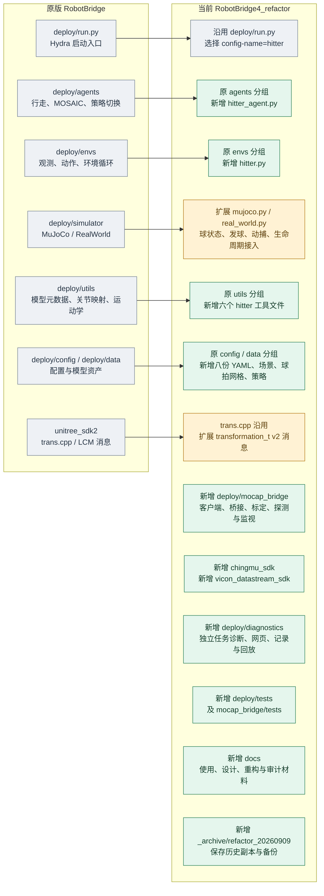
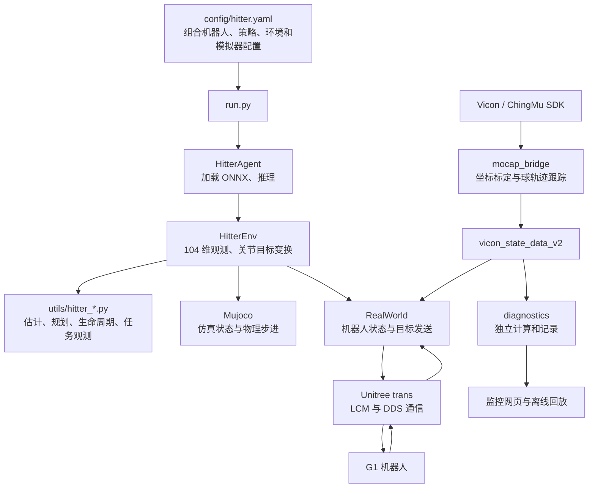

# RobotBridge 与 RobotBridge4_refactor：项目结构对比及新增模块使用说明

> 2026-09-19 资料整理：本文已从 Desktop 根目录移入资料目录，相关链接已更新。[资料总索引](../README.md)。历史核验日期与结论保留。

结构对比日期：2026-09-09；启动路径更新：2026-09-10。项目已移动到下表的新目录，本文命令和源码链接已同步更新。迁移修复与实测结果见 [迁移部署核验](../../RobotBridge4_refactor/docs/relocation_20260910.md)。

| 对比对象 | 目录 |
| --- | --- |
| 原版 RobotBridge | `/home/yhl/Desktop/BAAI-Humanoid/RobotBridge` |
| 当前 RobotBridge4 | `/home/yhl/Desktop/BOB/Hitter/RobotBridge4_refactor` |

**RobotBridge4 保留原版的 Hydra 启动、agent、env、simulator、utils 和 Unitree 通信框架，在这些模块中增加乒乓球任务，再新增动捕接入、任务诊断和测试模块。** 主入口仍是 `deploy/run.py`。HITTER 通过来球规划生成击球条件，再由 ONNX 策略输出 G1 的 29 关节动作。

“新增”均指相对原版新增，包含此前 HITTER 项目的功能和此次重构提取的公共模块。本文不再把重构前目录作为第三个对比对象。本文只整理文档，没有修改部署源码。

## 1. 两个项目的结构对比图

蓝灰色表示沿用，绿色表示新增，黄色表示原文件有扩展或差异。图中的文件名都是当前实际路径或明确的分组。



上图表达目录归属。运行时关系是：



MuJoCo 使用仿真中的球状态；真机使用动捕输入。诊断模块是独立订阅、独立计算的旁路，其页面不等于生产 policy 内部状态的直接镜像。

## 2. 当前新增文件有多少

重新读取两个目录并计算 SHA256 后，结果如下。比较的是同一路径的文件内容，不是 Git 提交差异，也不是程序文件数量。

| 类别 | 文件数 |
| --- | ---: |
| 同一路径、内容相同 | 1,313 |
| 同一路径、内容不同 | 11 |
| 仅当前副本存在 | 272 |
| 仅原版存在 | 37 |

272 个新增文件按模块分布如下：

| 模块 | 文件数 | 内容 |
| --- | ---: | --- |
| `deploy/agents`、`deploy/envs` | 2 | HITTER agent 和环境 |
| `deploy/utils` | 6 | 规划、运行、配置构造、类型、观测、JSON 工具 |
| `deploy/config` | 8 | HITTER Hydra 配置 |
| `deploy/data` | 29 | 场景 XML、5 个网格、模型和来源记录等 |
| `deploy/mocap_bridge` | 67 | 15 个根目录文件、38 个标定文件、9 个测试文件、5 个已有 bin 文件 |
| `deploy/diagnostics` | 10 | Python 诊断模块及 HTML 页面 |
| `deploy/tests` | 34 | 运行和诊断测试，包含两个测试辅助文件 |
| 两套厂商 SDK | 15 | ChingMu 9 个、Vicon 6 个文件 |
| `docs` | 76 | 使用说明、历史设计、重构报告及原始验证材料 |
| `_archive` | 20 | 历史副本和 `.before-*` 备份 |
| 其他 | 5 | `.claude/settings.local.json`、`.gitmodules`、两个历史运行日志和 `tracker_log.txt` |

统计排除了 `.git`、缓存、`build`、以 `.build` 开头的构建目录、`outputs`、`recordings` 和本地工具工作目录；目录名本身不计作文件。原有 `bin/` 文件、历史日志和归档文件仍计入，因此 272 不能解读为新增 272 个功能程序。本次扫描的两个目录均没有读取错误。

逐文件清单：[JSON](../核验材料/RobotBridge4_refactor_结构对比清单.json) / [CSV](../核验材料/RobotBridge4_refactor_结构对比清单.csv)。清单包含分类、两侧 SHA256、排除路径和读取结果。

## 3. 关键新增路径展开

下面展开新增功能文件，原有文件用分组表示；标注“修改”的文件本来就存在。

```text
RobotBridge4_refactor/
├── deploy/
│   ├── run.py                              沿用原入口
│   ├── agents/
│   │   ├── 原有 agent 文件
│   │   └── hitter_agent.py                 新增：HITTER 模型和推理循环
│   ├── envs/
│   │   ├── 原有 env 文件
│   │   └── hitter.py                       新增：击球环境
│   ├── simulator/
│   │   ├── base_sim.py                     沿用
│   │   ├── mujoco.py                       修改：乒乓球仿真接入
│   │   └── real_world.py                   修改：动捕和击球运行接入
│   ├── utils/
│   │   ├── 原有工具文件
│   │   ├── hitter_planner.py
│   │   ├── hitter_realtime.py
│   │   ├── hitter_runtime_factory.py
│   │   ├── hitter_runtime_types.py
│   │   ├── hitter_task_observation.py
│   │   └── hitter_serialization.py
│   ├── config/
│   │   ├── hitter.yaml
│   │   ├── agent/hitter.yaml
│   │   ├── env/hitter.yaml
│   │   ├── mimic/hitter.yaml
│   │   ├── obs/hitter.yaml
│   │   ├── robot/g1_hitter_racket.yaml
│   │   ├── asset/g1_hitter_racket.yaml
│   │   └── control/g1_hitter_racket.yaml
│   ├── data/
│   │   ├── assets/g1/g1_29dof_hitter_racket_table_tennis.xml
│   │   ├── assets/g1/meshes/                新增 5 个 hitter_frame.stl 网格
│   │   └── model/hitter/                   HITTER ONNX、训练检查点和来源记录
│   ├── mocap_bridge/
│   │   ├── mocap_types.py
│   │   ├── chingmu_sdk_client.py
│   │   ├── chingmu_table_lcm_bridge.py
│   │   ├── vicon_sdk_client.py
│   │   ├── vicon_table_lcm_bridge.py
│   │   ├── vicon_table_lcm_bridge.cpp
│   │   ├── vicon_frame_stream.cpp
│   │   ├── vicon_datastream_dump.cpp
│   │   ├── nexus_probe_cpp.cpp
│   │   ├── monitor_vicon_lcm.py
│   │   ├── run_robotbridge4_vicon_real.sh
│   │   ├── build_v2_mocap.sh
│   │   ├── build_vicon_frame_stream.sh
│   │   ├── build_cpp_probe.sh
│   │   ├── ROBOTBRIDGE4_REAL_DEPLOYMENT.md
│   │   ├── calibrations/                   38 个当前可读标定及标定备份
│   │   ├── tests/                          9 个 Python/C++ 测试文件
│   │   └── bin/                            已有探测和桥接二进制
│   ├── diagnostics/
│   │   ├── __init__.py
│   │   ├── hitter_task_models.py
│   │   ├── hitter_task_pipeline.py
│   │   ├── hitter_task_events.py
│   │   ├── hitter_task_attempts.py
│   │   ├── hitter_task_recording.py
│   │   ├── hitter_task_replay.py
│   │   ├── hitter_task_web.py
│   │   ├── hitter_task_monitor.py
│   │   └── static/hitter_task_monitor.html
│   └── tests/                              34 个测试及辅助文件
├── unitree_sdk2/
│   ├── trans.cpp                          沿用
│   └── lcm_types/transformation_t.*        修改：v2 动捕消息
├── chingmu_sdk/                             新增：厂商库、说明和 Demo
├── vicon_datastream_sdk/                    新增：厂商头文件和动态库
├── docs/                                   新增：功能、设计与重构文档
└── _archive/refactor_20260909/              新增：20 个历史文件
```

实际运行还会使用两个本机构建目录：`deploy/mocap_bridge/.build-v2/` 和 `unitree_sdk2/.build-robotbridge4-v2/`。它们是生成产物，未计入上述源码目录比较。

## 4. 新增核心代码：作用和调用方式

| 文件 | 作用 | 怎么使用 |
| --- | --- | --- |
| [agents/hitter_agent.py](../../RobotBridge4_refactor/deploy/agents/hitter_agent.py) | 加载 ONNX 及模型 metadata，配置关节信息，执行策略推理；真机每次推理前刷新观测 | 由 `run.py --config-name=hitter` 经 Hydra 创建，不单独执行该文件 |
| [envs/hitter.py](../../RobotBridge4_refactor/deploy/envs/hitter.py) | 组合机器人状态与击球任务条件，生成 104 维输入；平滑、缩放并重排 29 维策略输出；管理发球和策略会话 | 通过 HITTER 主配置启动；参数主要来自 `mimic/hitter.yaml` 与机器人 control 配置 |
| [utils/hitter_planner.py](../../RobotBridge4_refactor/deploy/utils/hitter_planner.py) | 球状态估计、轨迹预测、击球点/球拍速度和底座目标规划；输出 `HitterWbcCommand` | 环境或诊断流水线通过工厂构造 `HitterSystemPlanner`；调整 planner 配置，不用直接运行文件 |
| [utils/hitter_realtime.py](../../RobotBridge4_refactor/deploy/utils/hitter_realtime.py) | 不可变快照、完成结果队列、后台规划 worker、轨迹身份与单球生命周期 | 真机环境自动接入 listener/worker；MuJoCo 从仿真状态同步规划。状态包括 waiting、tracking、armed、recovery |
| [utils/hitter_runtime_factory.py](../../RobotBridge4_refactor/deploy/utils/hitter_runtime_factory.py) | 统一解析并校验配置，构造估计器、planner、运行设置和生命周期对象 | 运行与诊断复用同一套构造函数，避免分别解释同一份 YAML |
| [utils/hitter_runtime_types.py](../../RobotBridge4_refactor/deploy/utils/hitter_runtime_types.py) | 定义规划拒绝原因、`PlannerRejected`、`SnapshotKey(track_id, generation)` | 内部模块直接 import，用于区分旧球/新球及规划失败原因 |
| [utils/hitter_task_observation.py](../../RobotBridge4_refactor/deploy/utils/hitter_task_observation.py) | 组装任务相关的 11 维观测，处理坐标转换、范围校验和裁剪 | `HitterEnv` 和诊断流水线调用同一个组装函数；11 维只是完整 104 维输入的一部分 |
| [utils/hitter_serialization.py](../../RobotBridge4_refactor/deploy/utils/hitter_serialization.py) | 把 NumPy、字典和列表转换为独立、只读的 JSON 兼容快照，再转回可序列化对象 | 运行代码和 diagnostics 直接从此处导入 `freeze_json_value`、`to_builtin_json`；不再从诊断模型文件取公共工具 |

最后一个模块是重构时提取出的公共职责。代码归入原版已有的 `utils` 分组，运行核心因此不必依赖 `diagnostics`。

### 八份新增 YAML 分别控制什么

| 路径（相对 deploy/config） | 职责 / 常用入口 |
| --- | --- |
| `hitter.yaml` | 主配置，组合其余配置并默认选择 MuJoCo、CPU；用 `--config-name=hitter` 选择 |
| `agent/hitter.yaml` | `_target_: agents.hitter_agent.HitterAgent`，连接 env、checkpoint 和 device |
| `env/hitter.yaml` | `_target_: envs.hitter.HitterEnv`，传入 simulator、obs、control、motion、policy |
| `mimic/hitter.yaml` | ONNX 路径、动作平滑、首帧过渡、球规划和 Vicon consumer 参数；HITTER 的主要任务配置 |
| `obs/hitter.yaml` | 提供基类所需空配置；104 维观测由 HitterEnv 显式拼接，不由这里列举观测项 |
| `robot/g1_hitter_racket.yaml` | 组合专用 asset 与 control 配置 |
| `asset/g1_hitter_racket.yaml` | XML 路径、29 关节顺序、初始位置、默认角和增益等 |
| `control/g1_hitter_racket.yaml` | 步长、降采样、动作/力矩范围、viewer 和实时节拍；当前为 200 Hz 物理步进、50 Hz 策略 |

### 场景与模型资源

`data/assets/g1/g1_29dof_hitter_racket_table_tennis.xml` 提供 G1、球拍、球桌和球的场景。新增网格为 `h5002_face_contact_hitter_frame.stl`、`h5002_handle_hitter_frame.stl`、`h5002_head_hitter_frame.stl`、`right_hand_grip_hitter_frame.stl`、`right_paddle_hitter_frame.stl`，由场景引用，无需单独加载。

`data/model/hitter/` 保存多版模型及 `.provenance.txt` 来源记录，`checkpoints/` 中还有训练检查点。**当前实际选择由 YAML 的 checkpoint 决定，不会自动选择文件名最大的模型。** 当前配置为：

```text
data/model/hitter/hitter_model20500_20260818_104.onnx
输入：obs [1, 104]
输出：actions [1, 29]
```

部署动作的关节顺序、默认角和缩放还会读取 ONNX metadata；换模型时需要保持输入输出与关节契约一致。训练/导出在 MOSAIC 项目完成，RobotBridge4 是部署端。

## 5. 动捕新增模块：作用和使用路径

| 文件或分组 | 作用 | 使用方式 |
| --- | --- | --- |
| `mocap_types.py` | 两类客户端共享的 `MocapFrame`，包含帧号、时间、刚体位姿和 marker 数据 | 客户端从 `deploy.mocap_bridge.mocap_types` 直接导入；原始位置字段使用 mm，四元数为 xyzw |
| `chingmu_sdk_client.py` | ctypes 对接 ChingMu 厂商库、回调和刚体读取 | 由 ChingMu Python 桥接入口创建，库默认位于 `chingmu_sdk/ChingmuDLL/libCMVrpn.so` |
| `chingmu_table_lcm_bridge.py` | ChingMu 采集、球桌/骨盆标定、marker 筛选、球跟踪及 v2 发布 | 使用它自己的 CLI；须提供对应系统的 host 和标定，不沿用 Vicon 外参 |
| `vicon_sdk_client.py` | 启动 C++ 帧读取 helper，把 JSON 帧转换为共享 MocapFrame | 由 Vicon Python 桥创建；默认 helper 为 `bin/vicon_frame_stream` |
| `vicon_frame_stream.cpp` | 读取 Vicon DataStream 并输出帧数据，供 Python client 消费 | 使用 `build_vicon_frame_stream.sh` 构建；通常由 client 自动启动 |
| `vicon_table_lcm_bridge.py` | Vicon 的 Python 桥接路线，复用已有标定、球跟踪逻辑 | 通过自身 CLI 使用，当前专用真机启动器没有执行此 Python 文件 |
| `vicon_table_lcm_bridge.cpp` | C++ Vicon 标定、球跟踪和 LCM 发布实现 | 当前真机路线：编译为 `.build-v2/vicon_table_lcm_bridge_v2`，由专用启动器调用 |
| `run_robotbridge4_vicon_real.sh` | 固定 Vicon 地址、tracker、标定和通道，启动前校验 SHA256 与 planner 几何参数 | `--check-only` 离线预检；`--check-live` 连接设备检查 3 秒、不发布；无参数持续发布 |
| `monitor_vicon_lcm.py` | 订阅并检查 v2 消息、显示球状态，可导出 CSV | 已有 bridge 发布时独立运行，不启动 robot policy |
| `nexus_probe_cpp.cpp`、`vicon_datastream_dump.cpp` | SDK 连接及原始数据探测 | 排查设备/数据流时使用探测工具，不作为正常 policy 入口 |
| `calibrations/` | 两套动捕的球桌、骨盆外参及历史标定版本 | 当前 Vicon 启动器固定选择两份 20260822 validated 文件，其余文件不会自动参与启动 |
| `chingmu_sdk/`、`vicon_datastream_sdk/` | 厂商动态库、头文件、说明和示例 | 供对应 bridge/client 加载与编译；不是 HITTER 策略模块 |

`MocapFrame` 的独立文件使 Vicon client 不必为了获取类型而加载 ChingMu client；Vicon Python 桥仍复用既有桥接逻辑，二者不矛盾。

### 构建脚本各自的用途

| 脚本 | 输出与适用情况 |
| --- | --- |
| `build_v2_mocap.sh` | 当前 C++ v2 桥及两个协议/跟踪测试，输出 `.build-v2/`；依赖 `pkg-config lcm` |
| `build_vicon_frame_stream.sh` | Python Vicon 路线的 `bin/vicon_frame_stream` |
| `build_cpp_probe.sh` | 旧探测/桥接构建入口，输出 `bin/`；末尾还引用当前已不存在的 `tests/test_vicon_table_lcm_bridge.cpp`，不宜作为当前 v2 部署的一键构建命令 |

本机已于 2026-09-10 在新目录重新构建 v2 桥和 `trans`，修正旧构建中的绝对动态库路径和 CMake 缓存。本机没有系统 `pkg-config lcm` 配置，实际编译使用 isaaclab 中现有 LCM 头文件/库，命令和日志见 [部署启动核验](RobotBridge4_部署启动核验.md)。构建产物迁移到其他机器时需要重新检查架构和动态库路径。

### 查看两条 Python 桥的使用参数

以下只输出帮助，不连接设备：

```bash
cd /home/yhl/Desktop/BOB/Hitter/RobotBridge4_refactor
/home/yhl/miniforge3/envs/isaaclab/bin/python \
  deploy/mocap_bridge/chingmu_table_lcm_bridge.py --help
/home/yhl/miniforge3/envs/isaaclab/bin/python \
  deploy/mocap_bridge/vicon_table_lcm_bridge.py --help
```

切换动捕系统时需按对应 CLI 设置 `--host`、`--table-calib`、`--pelvis-orientation-calib` 和设备标识。当前项目的默认真机操作仍采用下一节的固定 Vicon 启动流程。

## 6. 直接使用：仿真、真机和消息监视

下列 Python 命令使用本机已有 isaaclab 环境。若现场已有原先可用的 rb 环境，可在激活该环境后使用 `python`；HITTER 源码需要 Python 3.10+，不能照原版旧 README 创建 Python 3.8 环境。

### MuJoCo 仿真

```bash
cd /home/yhl/Desktop/BOB/Hitter/RobotBridge4_refactor/deploy
/home/yhl/miniforge3/envs/isaaclab/bin/python run.py \
  --config-name=hitter sim=mujoco device=cpu
```

默认开启 viewer，按当前配置在仿真 0 秒和 20 秒各发球一次。无窗口运行时追加 `robot.control.viewer=false`。只检查组合后的配置，可追加 `--cfg job --resolve`。

### 真机部署

首先预检：

```bash
cd /home/yhl/Desktop/BOB/Hitter/RobotBridge4_refactor
bash deploy/mocap_bridge/run_robotbridge4_vicon_real.sh --check-only
```

预期最后输出 `Calibration preflight: PASS`。启动器固定使用：

- `calibrations/vicon_table_frame_20260822_validated.json`
- `calibrations/vicon_g1_pelvis_orientation_20260822_validated.json`
- Vicon 地址 `192.168.10.1:801`，tracker `G1Pelvis`，输出骨盆名称 `G2Pelvis`。
- LCM 通道 `vicon_state_data_v2`，URL `udpm://239.255.76.67:7667?ttl=255`。

现场部署顺序为 Vicon bridge、Unitree trans、HITTER policy。下面分别在三个终端执行；`YOUR_ROBOT_INTERFACE` 替换为现场实际机器人通信网卡。

```bash
# 终端 1：动捕发布
cd /home/yhl/Desktop/BOB/Hitter/RobotBridge4_refactor
bash deploy/mocap_bridge/run_robotbridge4_vicon_real.sh
```

```bash
# 终端 2：机器人通信
cd /home/yhl/Desktop/BOB/Hitter/RobotBridge4_refactor
LD_LIBRARY_PATH="$PWD/unitree_sdk2/thirdparty/lib/x86_64:${LD_LIBRARY_PATH:-}" \
  ./unitree_sdk2/.build-robotbridge4-v2/bin/trans YOUR_ROBOT_INTERFACE
```

```bash
# 终端 3：策略
cd /home/yhl/Desktop/BOB/Hitter/RobotBridge4_refactor/deploy
LOGURU_LEVEL=INFO PYTHONUNBUFFERED=1 \
  /home/yhl/miniforge3/envs/isaaclab/bin/python -u run.py \
  --config-name=hitter sim=real_world device=cpu
```

`trans` 按提示 Enter，Policy 沿用原来的 R2 按下/释放、姿态准备和首帧过渡流程。后端选择参数为 `sim=real_world`；HITTER 主入口不是默认的 `mosaic`。模型和资产使用相对路径，policy 命令需从 `deploy/` 执行。

### 单独检查动捕消息

已有 bridge 发布时，从项目根目录运行：

```bash
cd /home/yhl/Desktop/BOB/Hitter/RobotBridge4_refactor
/home/yhl/miniforge3/envs/isaaclab/bin/python \
  deploy/mocap_bridge/monitor_vicon_lcm.py \
  --channel vicon_state_data_v2 --duration 10
```

需要采样文件时追加 `--csv /tmp/robotbridge4_ball.csv`。该工具用于确认输入是否到达、帧与轨迹字段是否符合约定，不能证明实际触球或回球成功。

## 7. diagnostics：看什么、怎么打开

这是原版没有的独立任务诊断模块。它订阅动捕，在自己的进程中运行估计、规划、生命周期和 11 维任务观测，不加载控制 ONNX，也不发送机器人关节指令。

| 文件 | 作用 / 使用方法 |
| --- | --- |
| `hitter_task_monitor.py` | 唯一主 CLI，组织 LCM、处理流水线、网页和记录；用下面的命令启动 |
| `hitter_task_pipeline.py` | 把输入依次送入估计器、planner、生命周期和任务观测；monitor 内部调用 |
| `hitter_task_models.py` | 定义诊断快照、健康状态、生命周期等 schema；各诊断模块内部 import |
| `hitter_task_events.py` | 生成、缓存并分发状态变化事件；由 monitor/pipeline 使用 |
| `hitter_task_attempts.py` | 划分逐球 attempt，记录终态、统计和详情 |
| `hitter_task_recording.py` | 把样本、事件、逐球信息及会话 metadata 写盘 |
| `hitter_task_replay.py` | 捕获重放输入，独立进程执行 baseline parity 与反事实对照；由 monitor 调度，没有独立 argparse CLI |
| `hitter_task_web.py` | HTTP/SSE 服务；由 monitor 启动 |
| `static/hitter_task_monitor.html` | 浏览器页面，由 HTTP 服务提供；直接双击 HTML 不能代替后端 |
| `__init__.py` | diagnostics 包标记 |

### 启动当前 Vicon v2 对应的网页

```bash
cd /home/yhl/Desktop/BOB/Hitter/RobotBridge4_refactor/deploy
/home/yhl/miniforge3/envs/isaaclab/bin/python -m diagnostics.hitter_task_monitor \
  --mimic-config config/mimic/hitter.yaml \
  --control-config config/control/g1_hitter_racket.yaml \
  --table-calib mocap_bridge/calibrations/vicon_table_frame_20260822_validated.json \
  --pelvis-calib mocap_bridge/calibrations/vicon_g1_pelvis_orientation_20260822_validated.json \
  --lcm-url 'udpm://239.255.76.67:7667?ttl=255' \
  --channel vicon_state_data_v2 \
  --base-name G2Pelvis --ball-name ball --port 8766
```

浏览器打开 `http://127.0.0.1:8766/`。CLI 仍保留旧通道和 ChingMu 标定默认值，因此这里显式给出当前的 v2 通道与 Vicon 标定。查看完整任务规划还需要有效骨盆数据，仅收到球并不意味着规划链路全部就绪。

默认在项目根目录的 `recordings/hitter_task_diagnostics/` 下自动创建记录会话；可用 `--output-dir /你的记录目录` 指定位置，`--duration 30` 限制为 30 秒。会话包含 `session.json`、`ball_samples.csv`、`events.jsonl`、`attempts.csv`、`attempt_details/`、`replay_inputs/`、`replay_jobs.jsonl` 和 `replay_analysis.jsonl`。

回放由 monitor 在满足空闲条件时自动调度，结果反映诊断流水线的离线计算。网页中的计划击球时间到达、规划成功、轨迹结束和真实触球是不同事件。更多字段解释见 [任务诊断说明](../../RobotBridge4_refactor/docs/hitter_task_observation_diagnostics.md)；其中历史 RobotBridge2 路径和旧参数应以本文命令为准。

## 8. 测试、文档、历史归档怎么使用

| 新增部分 | 作用 | 使用方式 |
| --- | --- | --- |
| `deploy/tests/` | 规划参数、单球生命周期、首帧过渡、等待锚点、MuJoCo 球状态、诊断/网页/回放及共享模块隔离测试 | 在有 pytest 和部署依赖的环境中运行；`hitter_runtime_test_harness.py`、`hitter_test_factories.py` 是测试辅助模块，不是启动入口 |
| `deploy/mocap_bridge/tests/` | ChingMu/Vicon 客户端、marker 筛选、标定、v2 协议和球跟踪测试 | Python 测试由 pytest 运行；两个 C++ 测试由 v2 构建脚本生成并单独执行 |
| `docs/hitter_task_observation_diagnostics.md` | 任务诊断操作和字段解释 | 结合当前 v2 参数阅读 |
| `docs/superpowers/plans/`、`specs/` | 历史功能设计、实现计划及本次方案 | 用于追溯决策；旧文档里的路径不一定是当前入口 |
| `docs/refactor_20260909/` | 风格、结构、哈希、测试和审查记录 | 查逐文件清单和验证边界；`style_check.py --revision f558b7c` 用于复现风格阶段审计，不用于启动机器人 |
| `_archive/refactor_20260909/` | 20 个历史文件，保留其原相对目录：旧 `mocap_bridge (copy)` 13 个文件、第一方 `.before-*` 7 个文件 | 只作历史查阅；当前运行和测试不从此目录加载模块 |
| 厂商 Demo、旧日志、`.claude` 和 `.gitmodules` | SDK 示例、历史执行记录和工具/仓库配置 | 不参与 `run.py --config-name=hitter` 的主流程 |

一般测试入口如下，需在已安装 pytest 的部署环境中执行：

```bash
cd /home/yhl/Desktop/BOB/Hitter/RobotBridge4_refactor
PYTHONPATH="$PWD/deploy:$PWD" MUJOCO_GL=egl \
  python -m pytest deploy/tests deploy/mocap_bridge/tests
```

本机之前没有向 isaaclab 安装 pytest，而是使用 `/tmp/rb4-refactor-tools` 临时工具覆盖层；本机完整复现命令见 [重构验证说明](../../RobotBridge4_refactor/docs/refactor_20260909/verification_report.md)。测试目录存在不代表全套测试通过，已知失败见下一节。

## 9. 原版已有文件还有哪些差异

11 个同名不同内容的文件如下，避免把所有差异都误认为新增模块。

| 文件 | 当前差异及影响 |
| --- | --- |
| `deploy/simulator/mujoco.py` | 增加球状态、球复位/定时发球配合、球自由关节处理、viewer 等 HITTER 扩展 |
| `deploy/simulator/real_world.py` | 增加 v2 动捕消费、时效/轨迹检查、球状态快照、planner listener、会话/等待锚点等 |
| `unitree_sdk2/lcm_types/transformation_t.lcm` | 动捕消息包含帧号、源时间、发布时间、track_id、valid、occluded、位置和四元数 |
| `unitree_sdk2/lcm_types/transformation_t.hpp` | 对应的 C++ 消息编解码 |
| `unitree_sdk2/lcm_types/transformation_t.py` | 对应的 Python 消息编解码 |
| `unitree_sdk2/lcm_types/__init__.py` | 导出 transformation_t 类型 |
| `deploy/envs/mosaic.py` | 普通 MOSAIC 分支已有观测缓冲/拼接删减；与 HITTER 的 104 维入口分开理解 |
| `deploy/agents/base_agent.py` | 仅空白差异 |
| `.gitignore` | 忽略规则差异 |
| `README.md` | 项目说明、HITTER 入口和重构索引等差异 |
| `deploy/MUJOCO_LOG.TXT` | 运行日志内容差异，不是代码功能 |

`deploy/run.py`、`unitree_sdk2/trans.cpp`、`requirements.txt` 与原版内容相同。v2 消息两端必须使用当前一致的定义；`trans` 的原机器人通信职责继续保留。

37 个仅在原版存在的文件主要是 35 个 `.tmp.usd` 中间资产、`RobotBridge_中文学习说明.md` 和 `deploy/logs/metrics_policy.csv`；此次文档比较没有恢复或删除文件，完整路径在对比清单中。

## 10. 当前可用性与阅读入口

此前启动核验已用实际 MuJoCo CLI 运行，并完成重构前后各 1,100 步仿真对照。真机启动相关测试结果前后一致：118 通过、3 个已有失败；更广的重构测试仍有 110 个原有失败。MuJoCo 退出时的 `joint_state_subscriber` 错误和本机偶发导入异常也已记录，未在文档整理中修改代码。

真机只完成本机编译、动态库、配置和标定等离线检查，没有完成设备闭环验收。副本缺少从原 HITTER 目录无法读取的 12 个其他标定文件，但当前启动器选中的两份 20260822 标定完整且预检通过。本次两个目录扫描无读取错误，指的是当前副本内实际存在的文件，不意味着那 12 个缺失文件已补齐。

- [当前项目 README](../../RobotBridge4_refactor/README.md)
- [部署启动核验与完整构建命令](RobotBridge4_部署启动核验.md)
- [当前专用真机部署说明](../../RobotBridge4_refactor/deploy/mocap_bridge/ROBOTBRIDGE4_REAL_DEPLOYMENT.md)
- [重构逐文件审计与验证](../../RobotBridge4_refactor/docs/refactor_20260909/verification_report.md)
- [本次两方结构清单 JSON](../核验材料/RobotBridge4_refactor_结构对比清单.json) / [CSV](../核验材料/RobotBridge4_refactor_结构对比清单.csv)
