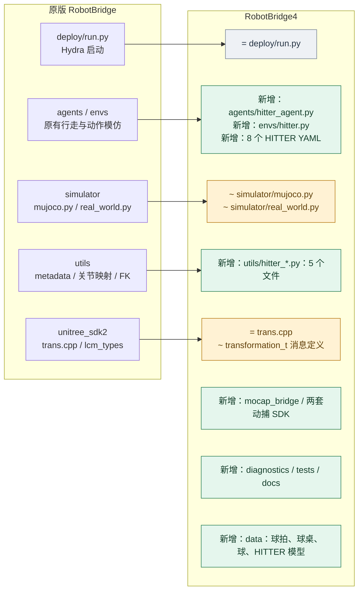

# RobotBridge → RobotBridge4 项目结构对比

> 2026-09-19 资料整理：本文已从 Desktop 根目录移入资料目录，相关链接已更新。[资料总索引](../README.md)。历史核验日期与结论保留。

> 重构交付索引（2026-09-09）：本文保留对原始目录的说明。已完成的可写副本见 [RobotBridge4_refactor README](../../RobotBridge4_refactor/README.md)，三方结构与本次变化见 [重构后项目结构对比](RobotBridge4_重构后项目结构对比.md)。

比较日期：2026-09-09。左侧基线为 `/home/yhl/Desktop/BAAI-Humanoid/RobotBridge`，右侧为 `/home/yhl/Desktop/BOB/Hitter/RobotBridge4`。这是当前本地文件的比较，不表示 Git 提交历史。

**图例：`+` 新增文件/目录；`~` 文件内容不同；`=` 文件内容相同；`−` 仅基线存在。** 新增目录中的子文件也都是相对基线新增。

## 1. 两个项目的结构关系



连线表示沿原目录结构扩展；不是运行时调用关系。原有通用模块大部分保留，右侧突出新增 HITTER 文件。下面的目录树可以在不支持 Mermaid 的编辑器中直接查看。

## 2. 主代码目录并排对比

```text
RobotBridge/                       │  RobotBridge4/
├── deploy/                        │  ├── deploy/
│   ├── run.py                     │  │   ├── run.py                                  =
│   ├── agents/                    │  │   ├── agents/
│   │   ├── base_agent.py          │  │   │   ├── base_agent.py                       ~ 仅空白变化
│   │   └── mosaic_agent.py 等     │  │   │   ├── mosaic_agent.py 等                  =
│   ├── envs/                      │  │   │   └── hitter_agent.py                     +
│   │   ├── base_env.py            │  │   ├── envs/
│   │   └── mosaic.py 等           │  │   │   ├── base_env.py                         =
│   ├── simulator/                 │  │   │   ├── mosaic.py                           ~
│   │   ├── base_sim.py            │  │   │   └── hitter.py                           +
│   │   ├── mujoco.py              │  │   ├── simulator/
│   │   └── real_world.py          │  │   │   ├── base_sim.py                         =
│   ├── utils/                     │  │   │   ├── mujoco.py                           ~
│   │   ├── dataset.py             │  │   │   └── real_world.py                       ~
│   │   ├── dof.py                 │  │   ├── utils/
│   │   └── kinematics.py 等       │  │   │   ├── dataset.py / dof.py / kinematics.py  =
│   ├── config/                    │  │   │   ├── hitter_planner.py                   +
│   │   └── 原有任务配置           │  │   │   ├── hitter_realtime.py                  +
│   └── data/                      │  │   │   ├── hitter_runtime_factory.py           +
│       ├── assets/                │  │   │   ├── hitter_runtime_types.py             +
│       └── model/                 │  │   │   └── hitter_task_observation.py          +
└── unitree_sdk2/                  │  │   ├── config/                                + 8 个 HITTER YAML
    ├── trans.cpp                  │  │   ├── data/                                  + 资产和模型
    └── lcm_types/                 │  │   ├── mocap_bridge/                          + 动捕与标定
                                   │  │   ├── diagnostics/                           + 旁路诊断
                                   │  │   └── tests/                                 + 测试及辅助文件
                                   │  ├── unitree_sdk2/
                                   │  │   ├── trans.cpp                              =
                                   │  │   └── lcm_types/transformation_t.*            ~
                                   │  ├── chingmu_sdk/                               +
                                   │  ├── vicon_datastream_sdk/                       +
                                   │  └── docs/                                      +
```

两列各自是一棵目录树，不按行一一对应；原有其他任务文件省略展示。

## 3. 新增文件展开图

以下按模块展开当前运行源码、配置和测试，模型、标定、历史副本等在后续折叠清单中完整列出。

```text
RobotBridge4/
└── deploy/
    ├── agents/
    │   └── hitter_agent.py  +
    ├── config/
    │   ├── agent/
    │   │   └── hitter.yaml  +
    │   ├── asset/
    │   │   └── g1_hitter_racket.yaml  +
    │   ├── control/
    │   │   └── g1_hitter_racket.yaml  +
    │   ├── env/
    │   │   └── hitter.yaml  +
    │   ├── hitter.yaml  +
    │   ├── mimic/
    │   │   └── hitter.yaml  +
    │   ├── obs/
    │   │   └── hitter.yaml  +
    │   └── robot/
    │       └── g1_hitter_racket.yaml  +
    ├── diagnostics/
    │   ├── __init__.py  +
    │   ├── hitter_task_attempts.py  +
    │   ├── hitter_task_events.py  +
    │   ├── hitter_task_models.py  +
    │   ├── hitter_task_monitor.py  +
    │   ├── hitter_task_pipeline.py  +
    │   ├── hitter_task_recording.py  +
    │   ├── hitter_task_replay.py  +
    │   ├── hitter_task_web.py  +
    │   └── static/
    │       └── hitter_task_monitor.html  +
    ├── envs/
    │   └── hitter.py  +
    ├── mocap_bridge/
    │   ├── build_cpp_probe.sh  +
    │   ├── build_v2_mocap.sh  +
    │   ├── build_vicon_frame_stream.sh  +
    │   ├── chingmu_sdk_client.py  +
    │   ├── chingmu_table_lcm_bridge.py  +
    │   ├── monitor_vicon_lcm.py  +
    │   ├── nexus_probe_cpp.cpp  +
    │   ├── run_robotbridge4_vicon_real.sh  +
    │   ├── tests/
    │   │   ├── test_chingmu_ball_track_v2.py  +
    │   │   ├── test_chingmu_ball_tracker_roi.py  +
    │   │   ├── test_chingmu_pelvis_orientation.py  +
    │   │   ├── test_mocap_v2_monitor.py  +
    │   │   ├── test_transformation_t_v2.cpp  +
    │   │   ├── test_transformation_t_v2.py  +
    │   │   ├── test_vicon_ball_track_v2.cpp  +
    │   │   ├── test_vicon_sdk_client.py  +
    │   │   └── test_vicon_table_lcm_bridge.py  +
    │   ├── vicon_datastream_dump.cpp  +
    │   ├── vicon_frame_stream.cpp  +
    │   ├── vicon_sdk_client.py  +
    │   ├── vicon_table_lcm_bridge.cpp  +
    │   └── vicon_table_lcm_bridge.py  +
    ├── tests/
    │   ├── hitter_runtime_test_harness.py  +
    │   ├── hitter_test_factories.py  +
    │   ├── test_hitter_backhand_edge_landing_bias.py  +
    │   ├── test_hitter_completed_result_queue.py  +
    │   ├── test_hitter_forehand_policy_vx_offset.py  +
    │   ├── test_hitter_planner_failure_reasons.py  +
    │   ├── test_hitter_planner_velocity_alignment.py  +
    │   ├── test_hitter_policy_first_frame_transition.py  +
    │   ├── test_hitter_runtime_factory.py  +
    │   ├── test_hitter_runtime_identity_types.py  +
    │   ├── test_hitter_runtime_single_shot_integration.py  +
    │   ├── test_hitter_single_shot_lifecycle.py  +
    │   ├── test_hitter_strike_target_logging.py  +
    │   ├── test_hitter_task_attempts.py  +
    │   ├── test_hitter_task_diagnostics_integration.py  +
    │   ├── test_hitter_task_diagnostics_performance.py  +
    │   ├── test_hitter_task_diagnostics_safety.py  +
    │   ├── test_hitter_task_events.py  +
    │   ├── test_hitter_task_frontend.py  +
    │   ├── test_hitter_task_input_adapter.py  +
    │   ├── test_hitter_task_monitor.py  +
    │   ├── test_hitter_task_observation.py  +
    │   ├── test_hitter_task_pipeline.py  +
    │   ├── test_hitter_task_recording.py  +
    │   ├── test_hitter_task_replay.py  +
    │   ├── test_hitter_task_replay_process.py  +
    │   ├── test_hitter_task_web.py  +
    │   ├── test_hitter_waiting_anchor.py  +
    │   ├── test_mujoco_hitter_track_id_v2.py  +
    │   ├── test_mujoco_physical_table_tennis.py  +
    │   ├── test_real_world_connection_wait.py  +
    │   └── test_real_world_v2_consumer.py  +
    └── utils/
        ├── hitter_planner.py  +
        ├── hitter_realtime.py  +
        ├── hitter_runtime_factory.py  +
        ├── hitter_runtime_types.py  +
        └── hitter_task_observation.py  +
```

## 4. 新增模块的作用

| 新增位置 | 主要文件 | 用途 |
| --- | --- | --- |
| `deploy/agents` | `hitter_agent.py` | HITTER ONNX 接入和推理循环 |
| `deploy/envs` | `hitter.py` | 任务集成、104 维观测、动作及复位管理 |
| `deploy/utils` | `hitter_planner.py` | 球状态估计、轨迹预测、击球与站位规划 |
| `deploy/utils` | `hitter_realtime.py` | 异步规划、轨迹身份、单球生命周期 |
| `deploy/utils` | `hitter_runtime_factory.py` | 从配置构造运行模块 |
| `deploy/utils` | `hitter_runtime_types.py` | 快照身份、失败原因等类型 |
| `deploy/utils` | `hitter_task_observation.py` | 11 维任务观测组装 |
| `deploy/config` | 8 个 HITTER YAML | 组合 HITTER agent/env、机器人、控制与规划参数 |
| `deploy/mocap_bridge` | Vicon/ChingMu bridge、启动和监视脚本 | 动捕读取、坐标标定、球跟踪与 LCM 发布 |
| `deploy/diagnostics` | `hitter_task_*.py` 和 HTML | 只读任务诊断网页、录制与回放 |
| `deploy/tests` | `test_*.py`、辅助文件 | 状态机、规划、观测、部署与诊断检查 |
| `deploy/data` | XML、球拍 STL、HITTER 模型 | 仿真资产与策略产物 |
| 根目录 SDK | `chingmu_sdk`、`vicon_datastream_sdk` | 动捕厂商接口 |
| `docs` | 诊断文档、设计和实施记录 | 使用说明与历史追溯 |

## 5. 原有文件的修改

新增与修改是不同概念。下表列出扫描范围内全部内容不同的原有文件。

| 文件 | 差异说明 |
| --- | --- |
| [.gitignore](../../RobotBridge4/.gitignore) | 忽略规则变化 |
| [README.md](../../RobotBridge4/README.md) | 说明文档变化 |
| [deploy/MUJOCO_LOG.TXT](../../RobotBridge4/deploy/MUJOCO_LOG.TXT) | 运行日志差异，不计为功能开发 |
| [deploy/agents/base_agent.py](../../RobotBridge4/deploy/agents/base_agent.py) | 仅空白变化，没有发现功能变化 |
| [deploy/envs/mosaic.py](../../RobotBridge4/deploy/envs/mosaic.py) | 相比当前基线少了 anchor position 和 base linear velocity 两项历史观测 |
| [deploy/simulator/mujoco.py](../../RobotBridge4/deploy/simulator/mujoco.py) | 新增球状态/发球接口、关节切片修正、无窗口与窗口锁处理 |
| [deploy/simulator/real_world.py](../../RobotBridge4/deploy/simulator/real_world.py) | 新增 v2 动捕输入、球估计、轨迹管理、有效性检查和通信退出处理 |
| [unitree_sdk2/lcm_types/__init__.py](../../RobotBridge4/unitree_sdk2/lcm_types/__init__.py) | 导出 transformation_t |
| [unitree_sdk2/lcm_types/transformation_t.hpp](../../RobotBridge4/unitree_sdk2/lcm_types/transformation_t.hpp) | 对应 C++ 消息定义变化 |
| [unitree_sdk2/lcm_types/transformation_t.lcm](../../RobotBridge4/unitree_sdk2/lcm_types/transformation_t.lcm) | 增加源帧、时间戳、track_id、valid、occluded |
| [unitree_sdk2/lcm_types/transformation_t.py](../../RobotBridge4/unitree_sdk2/lcm_types/transformation_t.py) | 对应 Python 消息定义变化 |

`run.py`、`BaseEnv`、`BaseSim`、metadata 工具 `dataset.py`、关节映射 `dof.py`、运动学工具 `kinematics.py`、`unitree_sdk2/trans.cpp`、`requirements.txt` 内容均相同。它们被新任务复用，不能标为新开发文件。

## 6. 完整新增文件清单

这里也保留模型、SDK 二进制、标定文件、日志、`.before-*` 备份和 `mocap_bridge (copy)` 副本，以避免将“主流程没有展开”误认为“文件不存在”。这些条目不都属于当前运行入口。

<details>
<summary>其他文件：5 个新增文件</summary>

```text
.claude/settings.local.json
.gitmodules
deploy/robotbridge2_model7900_20260725.log
deploy/robotbridge2_model8000_20260725.log
tracker_log.txt
```

</details>

<details>
<summary>外部 SDK：15 个新增文件</summary>

```text
chingmu_sdk/ChingmuDLL/libCMVrpn.so
chingmu_sdk/Demo/callback_data.py
chingmu_sdk/Demo/get_body_data.py
chingmu_sdk/Demo/get_hierarchy.py
chingmu_sdk/Demo/get_human_data.py
chingmu_sdk/Demo/get_marker_data.py
chingmu_sdk/Python SDK 说明.pdf
chingmu_sdk/README.md
chingmu_sdk/vrpn_client.exe
vicon_datastream_sdk/linux64/Linux64/DataStreamClient.h
vicon_datastream_sdk/linux64/Linux64/DataStreamRetimingClient.h
vicon_datastream_sdk/linux64/Linux64/IDataStreamClientBase.h
vicon_datastream_sdk/linux64/Linux64/libViconDataStreamSDK_C.so
vicon_datastream_sdk/linux64/Linux64/libViconDataStreamSDK_CPP.so
vicon_datastream_sdk/setup_env.sh
```

</details>

<details>
<summary>HITTER 核心代码与配置（含备份）：21 个新增文件</summary>

```text
deploy/agents/hitter_agent.py
deploy/config/agent/hitter.yaml
deploy/config/asset/g1_hitter_racket.yaml
deploy/config/control/g1_hitter_racket.yaml
deploy/config/env/hitter.yaml
deploy/config/hitter.yaml
deploy/config/mimic/hitter.yaml
deploy/config/mimic/hitter.yaml.before-model14100-20260808_135517
deploy/config/mimic/hitter.yaml.before-model60500-20260805
deploy/config/mimic/hitter.yaml.before-model7400-20260806_171240
deploy/config/mimic/hitter.yaml.before-racket-vel-align-main-20260805_163515
deploy/config/obs/hitter.yaml
deploy/config/robot/g1_hitter_racket.yaml
deploy/envs/hitter.py
deploy/utils/hitter_planner.py
deploy/utils/hitter_planner.py.before-racket-vel-align-main-20260805_163515
deploy/utils/hitter_realtime.py
deploy/utils/hitter_runtime_factory.py
deploy/utils/hitter_runtime_factory.py.before-racket-vel-align-main-20260805_163515
deploy/utils/hitter_runtime_types.py
deploy/utils/hitter_task_observation.py
```

</details>

<details>
<summary>机器人与乒乓球资产：6 个新增文件</summary>

```text
deploy/data/assets/g1/g1_29dof_hitter_racket_table_tennis.xml
deploy/data/assets/g1/meshes/h5002_face_contact_hitter_frame.stl
deploy/data/assets/g1/meshes/h5002_handle_hitter_frame.stl
deploy/data/assets/g1/meshes/h5002_head_hitter_frame.stl
deploy/data/assets/g1/meshes/right_hand_grip_hitter_frame.stl
deploy/data/assets/g1/meshes/right_paddle_hitter_frame.stl
```

</details>

<details>
<summary>HITTER 模型与来源记录：23 个新增文件</summary>

```text
deploy/data/model/hitter/checkpoints/hitter_june06_oldmotion_104_model_800_20260724.pt
deploy/data/model/hitter/hitter.onnx
deploy/data/model/hitter/hitter_model10595_A100_20260816_samechain_model7100_104.onnx
deploy/data/model/hitter/hitter_model10595_A100_20260816_samechain_model7100_104.provenance.txt
deploy/data/model/hitter/hitter_model14100_8x4090_poswin001_velstd18_velwin003_104_20260808.onnx
deploy/data/model/hitter/hitter_model17500_8x4090_poswin001_velstd18_velwin003_104_20260808.onnx
deploy/data/model/hitter/hitter_model17500_8x4090_poswin001_velstd18_velwin003_104_20260808.provenance.txt
deploy/data/model/hitter/hitter_model20500_20260818_104.onnx
deploy/data/model/hitter/hitter_model20500_20260818_104.provenance.txt
deploy/data/model/hitter/hitter_model5400_vx4to8_vz4to8_104_20260730.onnx
deploy/data/model/hitter/hitter_model56600_8x4090_poswin001_velstd18_velwin003_104_20260814.onnx
deploy/data/model/hitter/hitter_model56600_8x4090_poswin001_velstd18_velwin003_104_20260814.provenance.txt
deploy/data/model/hitter/hitter_model60500_vx4to8_vz4to8_tts060to092_phasealign_104_20260805.onnx
deploy/data/model/hitter/hitter_model60500_vx4to8_vz4to8_tts060to092_phasealign_104_20260805.provenance.txt
deploy/data/model/hitter/hitter_model7100_A100_20260815_resume6700_posstd012_104.onnx
deploy/data/model/hitter/hitter_model7100_A100_20260815_resume6700_posstd012_104.provenance.txt
deploy/data/model/hitter/hitter_model7400_vx0to4_vyneg14to14_vz0to4_tts030to092_posstd012_velstd2_velwin004_104_20260806.onnx
deploy/data/model/hitter/hitter_model7400_vx0to4_vyneg14to14_vz0to4_tts030to092_posstd012_velstd2_velwin004_104_20260806.provenance.txt
deploy/data/model/hitter/hitter_model7900_oldmotion_104_20260725.onnx
deploy/data/model/hitter/hitter_model7900_oldmotion_104_20260725.provenance.txt
deploy/data/model/hitter/hitter_model8000_oldmotion_104_20260725.onnx
deploy/data/model/hitter/hitter_model8000_oldmotion_104_20260725.provenance.txt
deploy/data/model/hitter/policy.onnx
```

</details>

<details>
<summary>诊断模块与网页：10 个新增文件</summary>

```text
deploy/diagnostics/__init__.py
deploy/diagnostics/hitter_task_attempts.py
deploy/diagnostics/hitter_task_events.py
deploy/diagnostics/hitter_task_models.py
deploy/diagnostics/hitter_task_monitor.py
deploy/diagnostics/hitter_task_pipeline.py
deploy/diagnostics/hitter_task_recording.py
deploy/diagnostics/hitter_task_replay.py
deploy/diagnostics/hitter_task_web.py
deploy/diagnostics/static/hitter_task_monitor.html
```

</details>

<details>
<summary>历史动捕副本：13 个新增文件</summary>

```text
deploy/mocap_bridge (copy)/bin/nexus_probe_cpp
deploy/mocap_bridge (copy)/bin/test_vicon_table_lcm_bridge
deploy/mocap_bridge (copy)/bin/vicon_table_lcm_bridge
deploy/mocap_bridge (copy)/build_cpp_probe.sh
deploy/mocap_bridge (copy)/calibrations/chingmu_table_frame_latest.json
deploy/mocap_bridge (copy)/calibrations/table_frame_latest.json
deploy/mocap_bridge (copy)/calibrations/table_frame_pre_tracer_20260715.json
deploy/mocap_bridge (copy)/calibrations/vicon_table_frame_candidate.json
deploy/mocap_bridge (copy)/chingmu_sdk_client.py
deploy/mocap_bridge (copy)/chingmu_table_lcm_bridge.py
deploy/mocap_bridge (copy)/monitor_vicon_lcm.py
deploy/mocap_bridge (copy)/nexus_probe_cpp.cpp
deploy/mocap_bridge (copy)/vicon_table_lcm_bridge.cpp
```

</details>

<details>
<summary>动捕模块、构建程序与动捕测试：28 个新增文件</summary>

```text
deploy/mocap_bridge/ROBOTBRIDGE4_REAL_DEPLOYMENT.md
deploy/mocap_bridge/bin/nexus_probe_cpp
deploy/mocap_bridge/bin/test_vicon_table_lcm_bridge
deploy/mocap_bridge/bin/vicon_datastream_dump
deploy/mocap_bridge/bin/vicon_frame_stream
deploy/mocap_bridge/bin/vicon_table_lcm_bridge
deploy/mocap_bridge/build_cpp_probe.sh
deploy/mocap_bridge/build_v2_mocap.sh
deploy/mocap_bridge/build_vicon_frame_stream.sh
deploy/mocap_bridge/chingmu_sdk_client.py
deploy/mocap_bridge/chingmu_table_lcm_bridge.py
deploy/mocap_bridge/monitor_vicon_lcm.py
deploy/mocap_bridge/nexus_probe_cpp.cpp
deploy/mocap_bridge/run_robotbridge4_vicon_real.sh
deploy/mocap_bridge/tests/test_chingmu_ball_track_v2.py
deploy/mocap_bridge/tests/test_chingmu_ball_tracker_roi.py
deploy/mocap_bridge/tests/test_chingmu_pelvis_orientation.py
deploy/mocap_bridge/tests/test_mocap_v2_monitor.py
deploy/mocap_bridge/tests/test_transformation_t_v2.cpp
deploy/mocap_bridge/tests/test_transformation_t_v2.py
deploy/mocap_bridge/tests/test_vicon_ball_track_v2.cpp
deploy/mocap_bridge/tests/test_vicon_sdk_client.py
deploy/mocap_bridge/tests/test_vicon_table_lcm_bridge.py
deploy/mocap_bridge/vicon_datastream_dump.cpp
deploy/mocap_bridge/vicon_frame_stream.cpp
deploy/mocap_bridge/vicon_sdk_client.py
deploy/mocap_bridge/vicon_table_lcm_bridge.cpp
deploy/mocap_bridge/vicon_table_lcm_bridge.py
```

</details>

<details>
<summary>标定文件：50 个新增文件</summary>

```text
deploy/mocap_bridge/calibrations/chingmu_g2_pelvis_orientation_latest.json
deploy/mocap_bridge/calibrations/chingmu_pelvis_orientation_20260725_candidate.json
deploy/mocap_bridge/calibrations/chingmu_pelvis_orientation_latest.json
deploy/mocap_bridge/calibrations/chingmu_table_frame_20260725_candidate.json
deploy/mocap_bridge/calibrations/chingmu_table_frame_latest.before_20260725_promotion.json
deploy/mocap_bridge/calibrations/chingmu_table_frame_latest.json
deploy/mocap_bridge/calibrations/table_frame_latest.20260709_114145.json
deploy/mocap_bridge/calibrations/table_frame_latest.json
deploy/mocap_bridge/calibrations/table_frame_pre_tracer_20260715.json
deploy/mocap_bridge/calibrations/vicon_g1_pelvis_orientation_20260805_before_translation.json
deploy/mocap_bridge/calibrations/vicon_g1_pelvis_orientation_20260805_validated.json
deploy/mocap_bridge/calibrations/vicon_g1_pelvis_orientation_20260807_live_retry.json
deploy/mocap_bridge/calibrations/vicon_g1_pelvis_orientation_20260807_live_retry_validated.json
deploy/mocap_bridge/calibrations/vicon_g1_pelvis_orientation_20260812_candidate.json
deploy/mocap_bridge/calibrations/vicon_g1_pelvis_orientation_20260812_validated.json
deploy/mocap_bridge/calibrations/vicon_g1_pelvis_orientation_20260813_validated.json
deploy/mocap_bridge/calibrations/vicon_g1_pelvis_orientation_20260818_candidate.json
deploy/mocap_bridge/calibrations/vicon_g1_pelvis_orientation_20260818_validated.json
deploy/mocap_bridge/calibrations/vicon_g1_pelvis_orientation_20260819_candidate.json
deploy/mocap_bridge/calibrations/vicon_g1_pelvis_orientation_20260819_rerun_candidate.json
deploy/mocap_bridge/calibrations/vicon_g1_pelvis_orientation_20260819_rerun_validated.json
deploy/mocap_bridge/calibrations/vicon_g1_pelvis_orientation_20260819_validated.json
deploy/mocap_bridge/calibrations/vicon_g1_pelvis_orientation_20260820_candidate.json
deploy/mocap_bridge/calibrations/vicon_g1_pelvis_orientation_20260820_validated.json
deploy/mocap_bridge/calibrations/vicon_g1_pelvis_orientation_20260821_candidate.json
deploy/mocap_bridge/calibrations/vicon_g1_pelvis_orientation_20260821_validated.json
deploy/mocap_bridge/calibrations/vicon_g1_pelvis_orientation_20260822_candidate.json
deploy/mocap_bridge/calibrations/vicon_g1_pelvis_orientation_20260822_validated.json
deploy/mocap_bridge/calibrations/vicon_table_frame_20260805_REJECTED_score1p0606.json
deploy/mocap_bridge/calibrations/vicon_table_frame_20260805_validated.before_robotbridge2_sync_20260807_165957.json
deploy/mocap_bridge/calibrations/vicon_table_frame_20260805_validated.json
deploy/mocap_bridge/calibrations/vicon_table_frame_20260807_164834_validated.json
deploy/mocap_bridge/calibrations/vicon_table_frame_20260807_candidate.json
deploy/mocap_bridge/calibrations/vicon_table_frame_20260807_live_retry.json
deploy/mocap_bridge/calibrations/vicon_table_frame_20260812_candidate.json
deploy/mocap_bridge/calibrations/vicon_table_frame_20260812_validated.json
deploy/mocap_bridge/calibrations/vicon_table_frame_20260813_validated.json
deploy/mocap_bridge/calibrations/vicon_table_frame_20260818_candidate.json
deploy/mocap_bridge/calibrations/vicon_table_frame_20260818_validated.json
deploy/mocap_bridge/calibrations/vicon_table_frame_20260819_candidate.json
deploy/mocap_bridge/calibrations/vicon_table_frame_20260819_rerun_candidate.json
deploy/mocap_bridge/calibrations/vicon_table_frame_20260819_rerun_validated.json
deploy/mocap_bridge/calibrations/vicon_table_frame_20260819_validated.json
deploy/mocap_bridge/calibrations/vicon_table_frame_20260820_candidate.json
deploy/mocap_bridge/calibrations/vicon_table_frame_20260820_validated.json
deploy/mocap_bridge/calibrations/vicon_table_frame_20260821_candidate.json
deploy/mocap_bridge/calibrations/vicon_table_frame_20260821_validated.json
deploy/mocap_bridge/calibrations/vicon_table_frame_20260822_candidate.json
deploy/mocap_bridge/calibrations/vicon_table_frame_20260822_validated.json
deploy/mocap_bridge/calibrations/vicon_table_frame_candidate.json
```

</details>

<details>
<summary>部署测试与测试辅助文件：33 个新增文件</summary>

```text
deploy/tests/hitter_runtime_test_harness.py
deploy/tests/hitter_test_factories.py
deploy/tests/test_hitter_backhand_edge_landing_bias.py
deploy/tests/test_hitter_completed_result_queue.py
deploy/tests/test_hitter_forehand_policy_vx_offset.py
deploy/tests/test_hitter_planner_failure_reasons.py
deploy/tests/test_hitter_planner_velocity_alignment.py
deploy/tests/test_hitter_policy_first_frame_transition.py
deploy/tests/test_hitter_runtime_factory.py
deploy/tests/test_hitter_runtime_factory.py.before-racket-vel-align-main-20260805_163515
deploy/tests/test_hitter_runtime_identity_types.py
deploy/tests/test_hitter_runtime_single_shot_integration.py
deploy/tests/test_hitter_single_shot_lifecycle.py
deploy/tests/test_hitter_strike_target_logging.py
deploy/tests/test_hitter_task_attempts.py
deploy/tests/test_hitter_task_diagnostics_integration.py
deploy/tests/test_hitter_task_diagnostics_performance.py
deploy/tests/test_hitter_task_diagnostics_safety.py
deploy/tests/test_hitter_task_events.py
deploy/tests/test_hitter_task_frontend.py
deploy/tests/test_hitter_task_input_adapter.py
deploy/tests/test_hitter_task_monitor.py
deploy/tests/test_hitter_task_observation.py
deploy/tests/test_hitter_task_pipeline.py
deploy/tests/test_hitter_task_recording.py
deploy/tests/test_hitter_task_replay.py
deploy/tests/test_hitter_task_replay_process.py
deploy/tests/test_hitter_task_web.py
deploy/tests/test_hitter_waiting_anchor.py
deploy/tests/test_mujoco_hitter_track_id_v2.py
deploy/tests/test_mujoco_physical_table_tennis.py
deploy/tests/test_real_world_connection_wait.py
deploy/tests/test_real_world_v2_consumer.py
```

</details>

<details>
<summary>项目文档与历史设计：41 个新增文件</summary>

```text
docs/hitter_task_observation_diagnostics.md
docs/superpowers/plans/2026-07-22-mujoco-air-model.md
docs/superpowers/plans/2026-07-22-mujoco-pure-physical-table-tennis.md
docs/superpowers/plans/2026-07-22-mujoco-two-serve-schedule.md
docs/superpowers/plans/2026-07-24-chingmu-pelvis-orientation-calibration.md
docs/superpowers/plans/2026-07-25-hitter-strike-target-logging.md
docs/superpowers/plans/2026-07-26-hitter-ready-arm-pose-editor.md
docs/superpowers/plans/2026-07-27-hitter-task-monitor-live-counter-display.md
docs/superpowers/plans/2026-07-27-hitter-task-observation-diagnostics.md
docs/superpowers/plans/2026-07-29-hitter-live-ball-diagnostics.md
docs/superpowers/plans/2026-07-31-chingmu-ball-far-edge-margin.md
docs/superpowers/plans/2026-07-31-hitter-complete-planner-csv-export.md
docs/superpowers/plans/2026-08-07-hitter-real-world-policy-first-frame-transition.md
docs/superpowers/plans/2026-08-13-hitter-armed-retain-last-good.md
docs/superpowers/plans/2026-08-13-hitter-bounce-retention-and-minimum-racket-speed.md
docs/superpowers/plans/2026-08-13-hitter-max-hit-height-3m.md
docs/superpowers/plans/2026-08-13-hitter-single-shot-track-id-safety.md
docs/superpowers/plans/2026-08-14-hitter-model56600-onnx-deployment.md
docs/superpowers/plans/2026-08-15-hitter-backhand-edge-landing-bias.md
docs/superpowers/plans/2026-08-15-real-world-backhand-racket-y-decrement.md
docs/superpowers/plans/2026-08-15-real-world-forehand-racket-x-offset.md
docs/superpowers/plans/2026-08-16-hitter-strike-velocity-compensation.md
docs/superpowers/specs/2026-07-22-mujoco-pure-physical-table-tennis-design.md
docs/superpowers/specs/2026-07-22-mujoco-two-serve-schedule-design.md
docs/superpowers/specs/2026-07-24-chingmu-pelvis-orientation-calibration-design.md
docs/superpowers/specs/2026-07-25-hitter-strike-target-logging-design.md
docs/superpowers/specs/2026-07-26-hitter-ready-arm-pose-editor-design.md
docs/superpowers/specs/2026-07-27-hitter-task-observation-diagnostics-design.md
docs/superpowers/specs/2026-07-29-hitter-live-ball-diagnostics-design.md
docs/superpowers/specs/2026-07-31-chingmu-ball-far-edge-margin-design.md
docs/superpowers/specs/2026-07-31-hitter-complete-planner-csv-export-design.md
docs/superpowers/specs/2026-08-07-hitter-real-world-policy-first-frame-transition-design.md
docs/superpowers/specs/2026-08-13-hitter-armed-retain-last-good-design.md
docs/superpowers/specs/2026-08-13-hitter-bounce-retention-and-minimum-racket-speed-design.md
docs/superpowers/specs/2026-08-13-hitter-max-hit-height-3m-design.md
docs/superpowers/specs/2026-08-13-hitter-single-shot-track-id-safety-design.md
docs/superpowers/specs/2026-08-14-hitter-model56600-onnx-deployment-design.md
docs/superpowers/specs/2026-08-15-hitter-backhand-edge-landing-bias-design.md
docs/superpowers/specs/2026-08-15-real-world-backhand-racket-y-decrement-design.md
docs/superpowers/specs/2026-08-15-real-world-forehand-racket-x-offset-design.md
docs/superpowers/specs/2026-08-16-hitter-strike-velocity-compensation-design.md
```

</details>

## 7. 仅基线存在的文件

这些文件在 RobotBridge4 中未发现；这不等于确认它们在某个提交中被删除。共 37 个，主要是临时 USD、旧中文说明和历史指标 CSV。

<details>
<summary>展开完整清单</summary>

```text
RobotBridge_中文学习说明.md
deploy/data/assets/g1/meshes/head_link.tmp.usd
deploy/data/assets/g1/meshes/left_ankle_pitch_link.tmp.usd
deploy/data/assets/g1/meshes/left_ankle_roll_link.tmp.usd
deploy/data/assets/g1/meshes/left_elbow_link.tmp.usd
deploy/data/assets/g1/meshes/left_hip_pitch_link.tmp.usd
deploy/data/assets/g1/meshes/left_hip_roll_link.tmp.usd
deploy/data/assets/g1/meshes/left_hip_yaw_link.tmp.usd
deploy/data/assets/g1/meshes/left_knee_link.tmp.usd
deploy/data/assets/g1/meshes/left_rubber_hand.tmp.usd
deploy/data/assets/g1/meshes/left_shoulder_pitch_link.tmp.usd
deploy/data/assets/g1/meshes/left_shoulder_roll_link.tmp.usd
deploy/data/assets/g1/meshes/left_shoulder_yaw_link.tmp.usd
deploy/data/assets/g1/meshes/left_wrist_pitch_link.tmp.usd
deploy/data/assets/g1/meshes/left_wrist_roll_link.tmp.usd
deploy/data/assets/g1/meshes/left_wrist_yaw_link.tmp.usd
deploy/data/assets/g1/meshes/logo_link.tmp.usd
deploy/data/assets/g1/meshes/pelvis.tmp.usd
deploy/data/assets/g1/meshes/pelvis_contour_link.tmp.usd
deploy/data/assets/g1/meshes/right_ankle_pitch_link.tmp.usd
deploy/data/assets/g1/meshes/right_ankle_roll_link.tmp.usd
deploy/data/assets/g1/meshes/right_elbow_link.tmp.usd
deploy/data/assets/g1/meshes/right_hip_pitch_link.tmp.usd
deploy/data/assets/g1/meshes/right_hip_roll_link.tmp.usd
deploy/data/assets/g1/meshes/right_hip_yaw_link.tmp.usd
deploy/data/assets/g1/meshes/right_knee_link.tmp.usd
deploy/data/assets/g1/meshes/right_rubber_hand.tmp.usd
deploy/data/assets/g1/meshes/right_shoulder_pitch_link.tmp.usd
deploy/data/assets/g1/meshes/right_shoulder_roll_link.tmp.usd
deploy/data/assets/g1/meshes/right_shoulder_yaw_link.tmp.usd
deploy/data/assets/g1/meshes/right_wrist_pitch_link.tmp.usd
deploy/data/assets/g1/meshes/right_wrist_roll_link.tmp.usd
deploy/data/assets/g1/meshes/right_wrist_yaw_link.tmp.usd
deploy/data/assets/g1/meshes/torso_link_rev_1_0.tmp.usd
deploy/data/assets/g1/meshes/waist_roll_link_rev_1_0.tmp.usd
deploy/data/assets/g1/meshes/waist_yaw_link_rev_1_0.tmp.usd
deploy/logs/metrics_policy.csv
```

</details>

## 8. 扫描口径

- 按相对路径识别新增/仅基线存在；对共同文件计算 SHA256 区分修改/相同。
- 识别到 **245 个新增文件、11 个内容不同文件、1313 个内容相同文件、37 个仅基线存在文件**。
- 排除 Git 元数据、Python/pytest 缓存、运行输出、录制目录、工作树、指定备份目录和构建目录：`.codex_backups`, `.git`, `.pytest_cache`, `.superpowers`, `.worktrees`, `__pycache__`, `build`, `outputs`, `recordings`, `.build*`。
- 新增文件只需确认相对路径存在，不要求读取模型、标定等文件内容。因此此处新增文件数量包含上一轮内容读取受限、但能列出名称的条目。
- 统计包含文档、SDK、模型和历史副本，不代表新增同等数量的业务源码。
- 两个项目目录未作改动；本文件是单独生成的对比文档。
